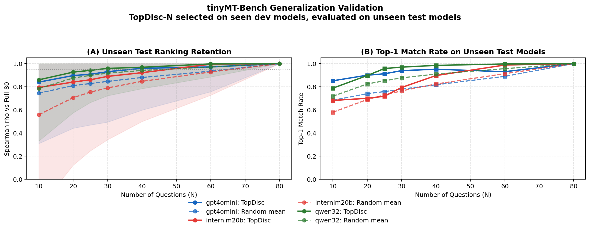
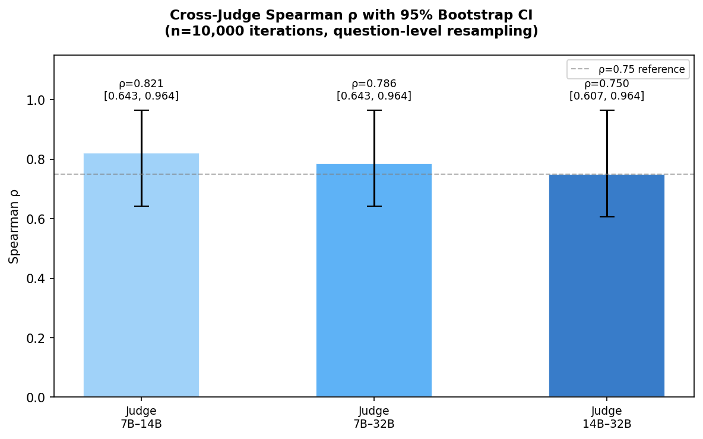
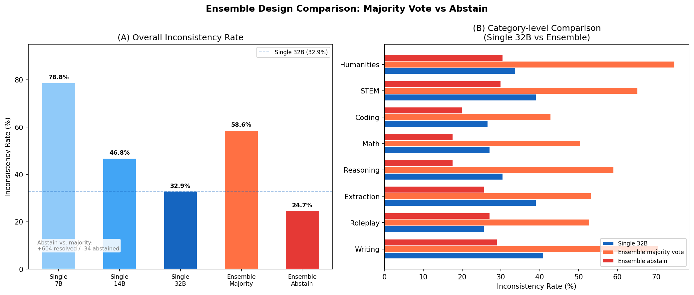

# Korean MT-Bench: 한국어 LLM Judge 신뢰도 벤치마크

한국어 환경에서 MT-Bench 기반 LLM-as-a-Judge 파이프라인의
**번역 타당성(validity)** 과 **현상 재현성(robustness)** 을 검증하는 연구.

> 논문 투고 대상: KCI 등재 학술지 | 논문 초안: [draft_paper.md](draft_paper.md)

---

## 연구 단계

| Phase | 내용 | 상태 |
|-------|------|------|
| **Phase 0** | 한국어 번역 + validity 검증 | 🔄 진행 중 |
| **Phase 1** | 한국어 데이터로 기존 분석 파이프라인 재실행 | ⏳ 대기 |
| **Phase 2** | 영어-한국어 비교 분석 | ⏳ 대기 |
| **Phase 3** | KCI 학술지 논문 작성 및 투고 | ⏳ 대기 |

---

## 영어 Baseline 실험 결과

7개 오픈소스 모델 × 5개 judge (Qwen 7B/14B/32B, InternLM2.5 7B/20B, GPT-4o-mini).
전체 결과 CSV: [`data/en/results/`](data/en/results/)

---

### 1. Judge별 모델 점수 비교


| 순위 | Qwen-7B | Qwen-14B | Qwen-32B | GPT-4o-mini |
|:---:|---------|---------|---------|------------|
| 1 | Phi-3.5-mini (8.04) | **Llama-3.1-8B (8.17)** | **gemma-2-9b (8.09)** | Phi-3.5-mini (7.98) |
| 2 | Yi-1.5-9B (7.98) | Phi-3.5-mini (8.09) | Phi-3.5-mini (8.06) | gemma-2-9b (7.96) |
| 3 | Llama-3.1-8B (7.89) | gemma-2-9b (8.03) | Yi-1.5-9B (7.79) | Yi-1.5-9B (7.78) |
| 4 | gemma-2-9b (7.87) | Yi-1.5-9B (7.97) | **Llama-3.1-8B (7.71)** | Llama-3.1-8B (7.76) |
| 5 | Mistral-7B (7.45) | Mistral-7B (7.49) | Mistral-7B (7.09) | Mistral-7B (7.20) |
| 6 | SOLAR-10.7B (7.34) | SOLAR-10.7B (7.07) | SOLAR-10.7B (7.02) | SOLAR-10.7B (6.82) |
| 7 | Zephyr-7B (7.20) | Zephyr-7B (7.04) | Zephyr-7B (6.62) | Zephyr-7B (6.66) |

**Llama-3.1-8B**: Qwen-14B에서 1위(8.17) → Qwen-32B에서 4위(7.71). 같은 모델, 같은 답변.

---

### 2. Judge 간 랭킹 일치도 (Spearman ρ / Kendall τ)


**Spearman ρ 히트맵** (값이 클수록 두 judge의 랭킹이 일치)

| | Qwen-7B | Qwen-14B | Qwen-32B | InternLM-7B | InternLM-20B | GPT-4o-mini |
|---|:---:|:---:|:---:|:---:|:---:|:---:|
| **Qwen-7B** | 1.000 | 0.821 | 0.786 | 0.793 | 0.607 | **0.893** |
| **Qwen-14B** | 0.821 | 1.000 | 0.750 | 0.667 | 0.571 | 0.786 |
| **Qwen-32B** | 0.786 | 0.750 | 1.000 | 0.937 | **0.893** | **0.964** |
| **InternLM-7B** | 0.793 | 0.667 | 0.937 | 1.000 | 0.775 | 0.883 |
| **InternLM-20B** | 0.607 | 0.571 | 0.893 | 0.775 | 1.000 | 0.857 |
| **GPT-4o-mini** | 0.893 | 0.786 | **0.964** | 0.883 | 0.857 | 1.000 |

**Kendall τ Distance** (값이 클수록 두 judge의 랭킹이 불일치)

| | Qwen-7B | Qwen-14B | Qwen-32B | GPT-4o-mini |
|---|:---:|:---:|:---:|:---:|
| **Qwen-7B** | 0.000 | 0.143 | 0.143 | 0.095 |
| **Qwen-14B** | 0.143 | 0.000 | **0.190** | 0.143 |
| **Qwen-32B** | 0.143 | **0.190** | 0.000 | **0.048** |
| **GPT-4o-mini** | 0.095 | 0.143 | **0.048** | 0.000 |

- **Qwen-32B ↔ GPT-4o-mini**: ρ=0.964, τ=0.048 → 충분히 큰 오픈소스 judge는 중립 judge에 수렴
- **Qwen-14B ↔ Qwen-32B**: τ=0.190 → 같은 패밀리 내에서도 크기에 따라 랭킹이 가장 크게 달라짐

---

### 3. Judge 크기 스케일링 (불일치율 / Position Bias)


| Judge | 파라미터 | 불일치율 | decisive율 | First-position 승률 | Position bias |
|-------|---------|---------|-----------|-------------------|--------------|
| Qwen-7B | 7B | 78.75% | 21.25% | 84.2% | 0.342 |
| Qwen-14B | 14B | 46.85% | 53.15% | 93.5% | 0.435 |
| Qwen-32B | 32B | 32.86% | 66.96% | 94.9% | 0.449 |
| InternLM-7B | 7B | 15.06% | 12.32% | 85.0% | — |
| InternLM-20B | 20B | 43.57% | 48.27% | 95.4% | — |
| GPT-4o-mini | API | 33.99% | 66.01% | 99.7% | — |

judge가 클수록 불일치율은 감소하지만, **남아있는 불일치는 더 순서 민감**해진다.

**카테고리별 Position Bias** (Qwen judge 3종 비교)


| 카테고리 | 7B 불일치율 | 32B 불일치율 | 7B bias | 32B bias |
|---------|-----------|-----------|--------|--------|
| stem | 95.2% | 39.1% | 0.370 | 0.500 |
| humanities | 96.2% | 33.8% | 0.342 | 0.458 |
| writing | 86.2% | 41.0% | 0.345 | 0.488 |
| coding | 83.8% | 26.7% | 0.392 | 0.375 |
| extraction | 62.9% | 39.1% | 0.386 | 0.463 |
| math | 75.7% | 27.1% | 0.305 | 0.307 |
| reasoning | 75.2% | 30.5% | 0.266 | 0.469 |
| roleplay | 54.8% | 25.7% | 0.317 | 0.482 |

---

### 4. Turn 2 구조적 난이도


대부분의 카테고리에서 Turn 2 점수가 Turn 1 대비 하락. 특히 writing, roleplay에서 두드러짐.

---

### 5. 카테고리별 분석


---

### 6. tinyMT-Bench: 비용 50% 절감

변별도 기준 문항 선택으로 평가 비용을 줄이면서 랭킹 보존.


| 문항 수 | Random ρ (평균) | Top-Disc ρ |
|--------|--------------|-----------|
| 10 | 0.866 | 0.929 |
| 20 | 0.931 | 0.893 |
| 40 | 0.959 | **1.000** |
| 60 | 0.972 | **1.000** |
| 80 | 1.000 | 1.000 |

**Top-40 문항**으로 전체 80문항과 동일 랭킹 달성 (ρ=1.000).



---

### 7. Bootstrap 95% CI (통계적 유의성)



| Judge 쌍 | Spearman ρ | 95% CI |
|---------|-----------|--------|
| Qwen-7B ↔ Qwen-14B | 0.821 | [0.643, 0.964] |
| Qwen-7B ↔ Qwen-32B | 0.786 | [0.643, 0.964] |
| Qwen-14B ↔ Qwen-32B | 0.750 | [0.607, 0.964] |

---

### 8. 앙상블 Judge



다수결 앙상블(58.6%)은 단일 고품질 judge(32B: 32.9%)보다 불일치율 높음.
abstain 기반 개선 앙상블은 불일치율 24.7%로 최저, decisive율 75.3%.

---

### 9. 외부 Judge 검증 (InternLM / GPT-4o-mini)


Qwen-32B 기준 모델 서열이 InternLM2.5-20B(ρ=0.893), GPT-4o-mini(ρ=0.964)에서 유지.

---

## Phase 0: 번역 품질 검증

### 번역 대상
- MT-Bench 80문항 × 2턴 = **160개 텍스트** 수작업 번역
- reference 39문항 포함 | 가이드라인: [`data/ko/translation_notes.md`](data/ko/translation_notes.md)

### 검증 지표

| 검증 | 지표 | 기준 |
|------|------|------|
| Back-translation | BLEU | 카테고리 평균 ≥ 0.3 |
| 의미 보존 | LLM semantic score (1~5) | 평균 ≥ 4.0 |
| 변별력 보존 | Spearman ρ (Top-Disc) | ρ ≥ 0.8 |

```bash
python3 scripts/translate/validate_translation.py
python3 scripts/translate/back_translate.py
export PYTHONPATH=src && python3 scripts/analysis/analyze_translation_validity.py
```

---

## 빠른 시작

```bash
git clone https://github.com/kook222/mt_bench_repro.git korean_mt_bench
cd korean_mt_bench && pip install -r requirements.txt
export PYTHONPATH=src
bash scripts/tools/download_dataset.sh
bash scripts/run/local/run_mock_full.sh
```

---

## 인용

```bibtex
@inproceedings{zheng2023judging,
  title={Judging LLM-as-a-Judge with MT-Bench and Chatbot Arena},
  author={Zheng, Lianmin and others},
  booktitle={NeurIPS},
  year={2023}
}
```
