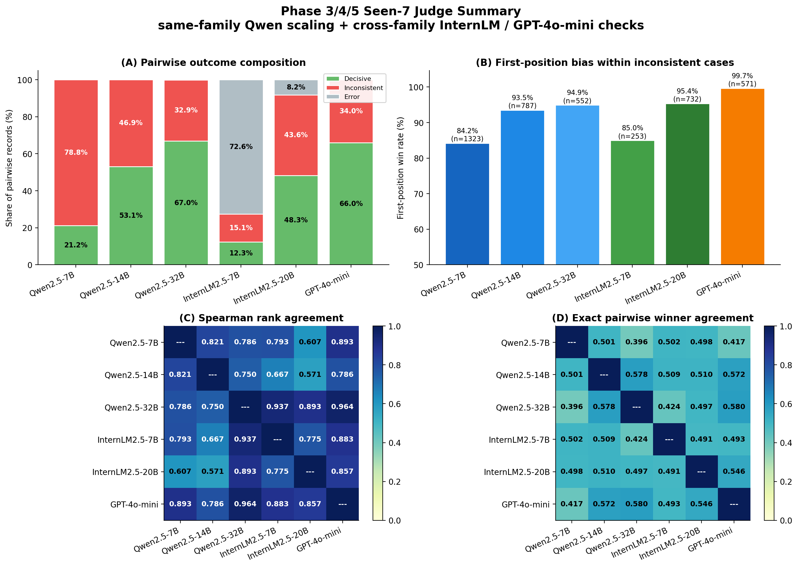

<div align="center">

# MT-Bench 재현 — Self-Judge Bias 분석

**NeurIPS 2023 _"Judging LLM-as-a-Judge with MT-Bench and Chatbot Arena"_ 재현 및 확장**

[](https://www.python.org/)
[](https://arxiv.org/abs/2306.05685)
[](https://www.nvidia.com/)

</div>

---

## 연구 개요

LLM-as-a-Judge 방식에서 **judge 모델의 선택이 평가 결과를 왜곡하는가?**

본 연구는 세 가지 주장을 중심으로 MT-Bench 평가 프레임워크를 재현하고 확장한다.

| 주장 | 내용 | 측정 방법 |
|------|------|---------|
| **1** | Judge 선택이 모델 랭킹을 바꾼다 | Kendall τ distance + Bootstrap 95% CI |
| **2** | Judge는 같은 family eval 모델을 유리하게 채점한다 (self-judge bias) | Bias score = ref_rank − own_rank |
| **3** | Bias는 Turn 2와 특정 카테고리에 집중된다 | Turn δ 분석 + tinyMT-Bench |

---

## 목차

- [실험 설계](#실험-설계)
- [Phase 1 — 기준선 수립](#phase-1--기준선-수립)
- [Phase 3 — Qwen Judge Scaling](#phase-3--qwen-judge-scaling)
- [Phase 4 — LLaMA Judge & Self-Judge Bias](#phase-4--llama-judge--self-judge-bias)
- [보조 분석](#보조-분석)
- [실행 방법](#실행-방법)
- [저장소 구조](#저장소-구조)

---

## 실험 설계

### Judge 모델 (6개)

| Judge | Family | 크기 | 비고 |
|-------|--------|------|------|
| Llama-2-7b-chat | **LLaMA** | 7B | Self-judge: Llama-2-7b-chat eval 모델 직접 채점 |
| Llama-2-13b-chat | **LLaMA** | 13B | |
| Qwen2.5-7B-Instruct | **Qwen** | 7B | Phase 3 기존 데이터 |
| Qwen2.5-14B-Instruct | **Qwen** | 14B | Phase 3 기존 데이터 |
| Qwen2.5-32B-Instruct | **Qwen** | 32B | Phase 3 기존 데이터 |
| GPT-4o-mini | GPT | — | 중립 reference judge |

### Eval 모델 (9개)

Self-judge bias 증명을 위해 eval 모델에 LLaMA family + Qwen family를 모두 포함.

| 모델 | Family | 비고 |
|------|--------|------|
| **Llama-2-7b-chat** | LLaMA | judge이기도 함 → 완전한 self-judge 케이스 |
| Llama-3.1-8B-Instruct | LLaMA | |
| **Qwen2.5-7B-Instruct** | Qwen | judge이기도 함 → Qwen self-judge 케이스 |
| **Qwen2.5-14B-Instruct** | Qwen | judge이기도 함 → Qwen self-judge 케이스 |
| Mistral-7B-Instruct-v0.3 | neutral | |
| gemma-2-9b-it | neutral | |
| Phi-3.5-mini-Instruct | neutral | |
| SOLAR-10.7B-Instruct | neutral | |
| Zephyr-7B-beta | neutral | |

**굵은 모델** = judge와 eval 양쪽에 존재 → self-judge bias 직접 측정 가능.

---

## Phase 1 — 기준선 수립

MT-Bench 파이프라인이 올바르게 동작하는지 검증하고 기준 랭킹을 수립.

<p align="center">
  
</p>

**Fig 1. 모델별 MT-Bench 점수 (Phase 1 기준선)**

<p align="center">
  
</p>

**Fig 2. 카테고리별 성능 히트맵** — 모델마다 강점 카테고리가 다르다.

<p align="center">
  
</p>

**Fig 3. 전체 모델 랭킹**

---

## Phase 3 — Qwen Judge Scaling

Qwen2.5 family (7B / 14B / 32B)를 judge로 사용해 judge 크기에 따른 평가 안정성을 측정.

<p align="center">
  
</p>

**Fig 4. Judge 크기 스케일링** — judge가 클수록 inconsistency율이 낮아진다.

<p align="center">
  
</p>

**Fig 5. Qwen judge 크기별 모델 점수 비교** — judge 크기에 따라 모델 순위가 달라진다.

<p align="center">
  
</p>

**Fig 6. Judge 간 Spearman ρ 히트맵** — Qwen family 내부는 높은 일치도를 보인다.

<p align="center">
  
</p>

**Fig 7. 문항 수 민감도** — 몇 개 문항만으로 안정적인 랭킹이 가능한가.

<p align="center">
  
</p>

**Fig 8. Cross-Judge Spearman ρ + Bootstrap 95% CI** — 점 추정만으로는 부족하다.

---

## Phase 4 — LLaMA Judge & Self-Judge Bias

LLaMA 2 family (7B / 13B)를 judge로 추가해 Qwen judge, GPT-4o-mini와 비교.

> **진행 중** — `run_judge_llama_a100.sh` 실행 후 `analyze_self_judge_bias.py`로 생성됨.

**예상 결과:**

```
Kendall τ distance 히트맵:

             Qwen7B  Qwen14B  Qwen32B  GPT-mini  LLaMA7B  LLaMA13B
Qwen7B         0      낮음     낮음      중간       높음      높음
Qwen14B       낮음      0      낮음      중간       높음      높음
GPT-mini      중간     중간     중간        0        중간      중간
LLaMA7B       높음     높음     높음      중간         0       낮음
LLaMA13B      높음     높음     높음      중간        낮음       0
```

같은 family끼리 τ distance가 낮고, 다른 family끼리 높다 → **self-judge bias 존재 증명**.

<p align="center">
  
</p>

**Fig 9. Judge family 비교 요약** — Qwen, InternLM, GPT-4o-mini 간 랭킹 불일치 패턴.

---

## 보조 분석

### Turn 2 구조적 난이도

<p align="center">
  
</p>

**Fig 10. Turn 1 → Turn 2 점수 변화 (δ)**

**주장**: MT-Bench Turn 2는 구조적으로 어렵다. 카테고리별 δ 크기가 다르며 (reasoning/math > writing/humanities), LLaMA eval 모델의 δ가 LLaMA judge에서 덜 하락하는 패턴은 **self-judge bias가 Turn 2에서 강화된다**는 근거가 된다.

---

### tinyMT-Bench — 최소 변별 문항 세트

<p align="center">
  
</p>

**Fig 11. 문항별 변별도 (inter-model score std)**

<p align="center">
  
</p>

**Fig 12. tinyMT-Bench — Random vs Top-Discriminative 문항 선택**

**주장**: 변별도 상위 N개 문항만으로도 80개 전체와 동일한 랭킹(Spearman ρ ≥ 0.9)을 유지한다. 이 최소 문항 세트에서 **self-judge bias가 어느 카테고리에 집중되는지** 파악할 수 있다.

---

### 변별도 기반 갭 분석

<p align="center">
  
</p>

**Fig 13. Hard/Easy 문항 갭 분석**

---

## 실행 방법

### 환경 설정

```bash
cd mt_bench_repro
pip install -r requirements.txt
export PYTHONPATH=src
```

### A100 실행 순서

```bash
# 1. 신규 eval 모델 답변 생성 (Llama-2-7b, Qwen2.5-7B/14B)
bash scripts/run/a100/run_generate_self_judge_a100.sh

# 2. LLaMA judge 채점 (7B / 13B)
bash scripts/run/a100/run_judge_llama_a100.sh

# 3. 핵심 분석
export PYTHONPATH=src
python3 scripts/analysis/analyze_self_judge_bias.py

# 4. 보조 분석
python3 scripts/analysis/analyze_turn_degradation.py
python3 scripts/analysis/analyze_tiny_mt_bench.py
```

### LLaMA 2 모델 다운로드 (HF 로그인 필요)

```bash
huggingface-cli login   # 토큰 입력

huggingface-cli download meta-llama/Llama-2-7b-chat-hf \
  --local-dir $HOME_DIR/models/Llama-2-7b-chat

huggingface-cli download meta-llama/Llama-2-13b-chat-hf \
  --local-dir $HOME_DIR/models/Llama-2-13b-chat
```

---

## 저장소 구조

```
mt_bench_repro/
├── src/mtbench_repro/
│   ├── schemas.py          ← 데이터 스키마 + 카테고리 상수
│   ├── client.py           ← ChatClient (OpenAI / vLLM / mock)
│   ├── prompts.py          ← judge 프롬프트 6종
│   ├── judge_single.py     ← 1–10점 채점
│   ├── judge_pairwise.py   ← AB/BA swap 비교
│   ├── judge_reference.py  ← 정답 참고 채점
│   ├── aggregate.py        ← 점수 집계 + 랭킹
│   └── cli.py              ← CLI 진입점
│
├── scripts/
│   ├── analysis/
│   │   ├── analyze_self_judge_bias.py   ← 핵심 (Kendall τ + bias)
│   │   ├── analyze_turn_degradation.py  ← Turn 2 난이도
│   │   ├── analyze_tiny_mt_bench.py     ← 최소 문항 세트
│   │   ├── analyze_discriminability.py  ← 변별도
│   │   ├── analyze_bootstrap_ci.py      ← Bootstrap CI
│   │   ├── analyze_phase3.py            ← Qwen judge scaling
│   │   └── _deprecated/                 ← 앙상블 등 제거됨
│   └── run/a100/
│       ├── run_generate_self_judge_a100.sh  ← 신규 eval 답변 생성
│       ├── run_judge_llama_a100.sh          ← LLaMA judge
│       └── run_judge_phase3_a100.sh         ← Qwen judge
│
└── data/
    ├── mt_bench_questions.jsonl
    ├── answers/                     ← eval 모델 답변 (git 제외)
    ├── judgments_phase3/            ← Qwen judge 결과
    ├── judgments_llama_judge/       ← LLaMA judge 결과
    ├── judgments_phase5/            ← GPT-4o-mini judge 결과
    └── results_*.csv                ← 집계 산출물
```
