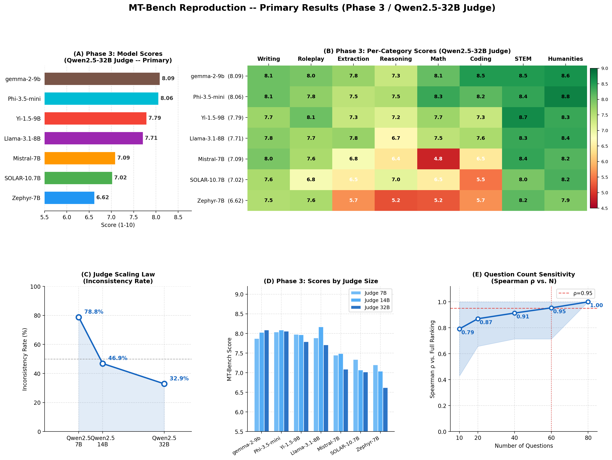
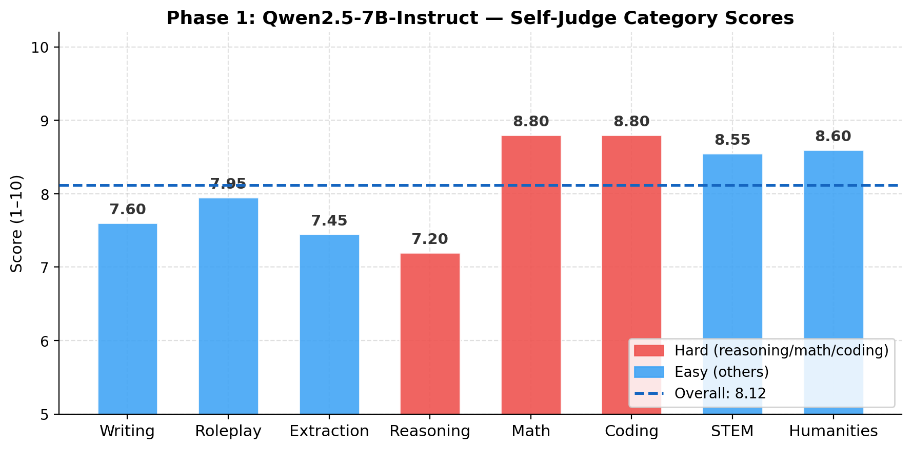
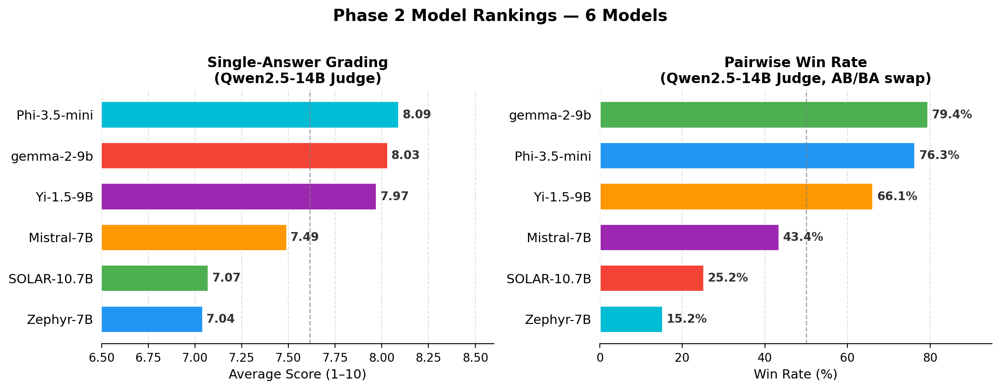
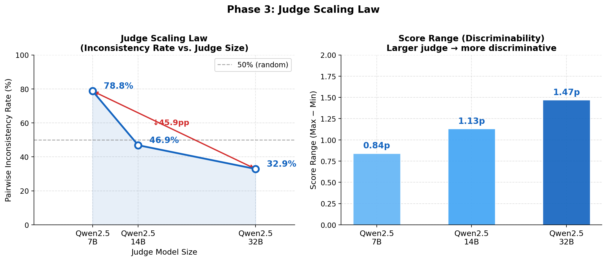
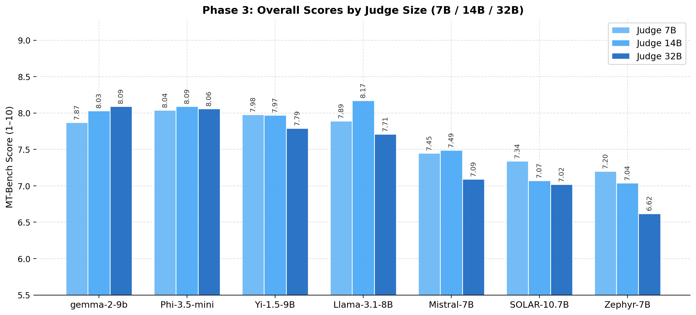
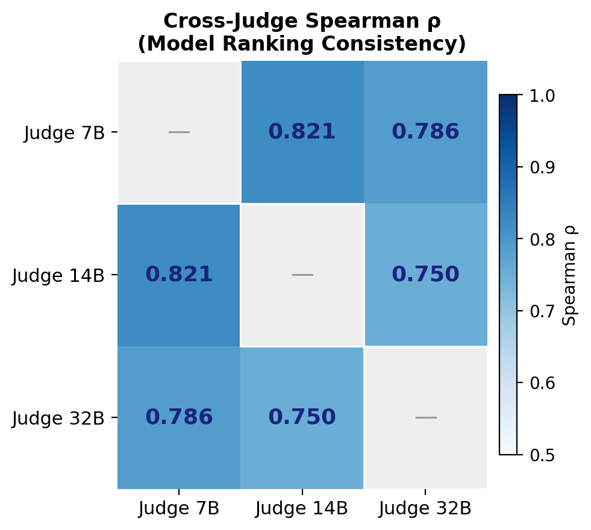
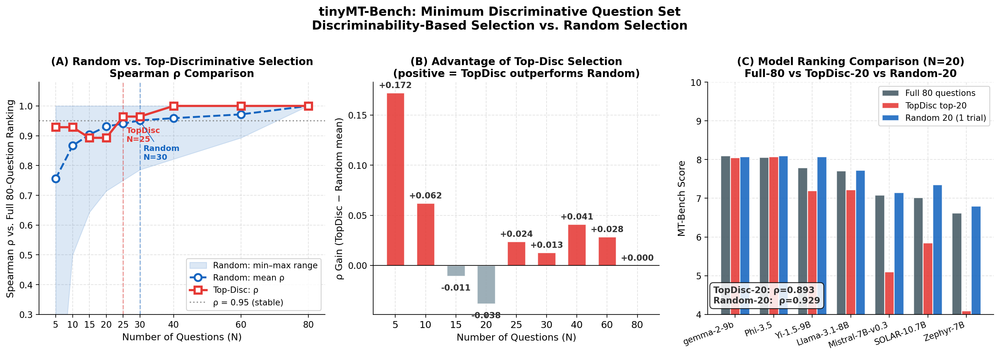
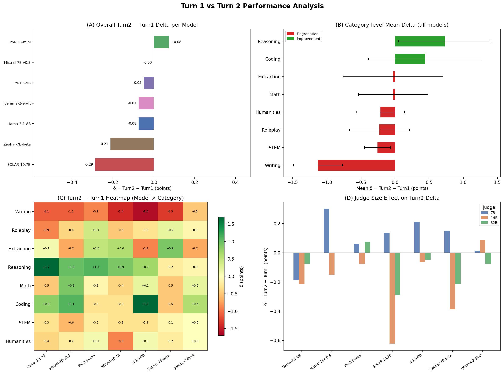
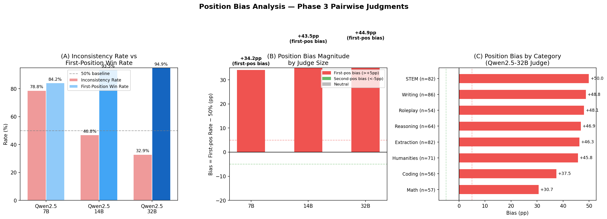

<div align="center">

# MT-Bench 재현

**NeurIPS 2023 논문 _"Judging LLM-as-a-Judge with MT-Bench and Chatbot Arena"_ 재현**

[](https://www.python.org/)
[](LICENSE)
[](https://arxiv.org/abs/2306.05685)
[](https://www.nvidia.com/)
[](CITATION.cff)

</div>

---

> **목표:** NeurIPS 2023 MT-Bench 논문의 *모델 서열*과 *카테고리별 성능 추이*를 오픈소스 모델(2024–2025 세대)과 로컬 vLLM judge로 재현.
> 정확한 점수 일치는 목표가 아님.

<p align="center">
  
</p>

---

## 목차

- [개요](#개요)
- [실험 설정](#실험-설정)
- [Phase 1 — 파이프라인 검증 & Self-Judge 기준선](#phase-1--파이프라인-검증--self-judge-기준선)
- [Phase 2 — 예비 비교 실험](#phase-2--예비-비교-실험)
- [Phase 3 — 주요 결과](#phase-3--주요-결과)
  - [Judge 스케일링 법칙](#judge-스케일링-법칙)
  - [모델 서열 (32B judge 기준)](#모델-서열-32b-judge-기준)
  - [Cross-Judge Spearman ρ](#cross-judge-spearman-ρ)
  - [변별도 기반 갭 분석](#변별도-기반-갭-분석)
  - [tinyMT-Bench — 최소 변별 문항 세트 발굴](#tinymT-bench--최소-변별-문항-세트-발굴)
  - [Turn 1 vs Turn 2 성능 저하 분석](#turn-1-vs-turn-2-성능-저하-분석)
  - [Position Bias 정량화](#position-bias-정량화)
- [원본 논문과 비교](#원본-논문과-비교)
- [결론](#결론)
- [저장소 구조](#저장소-구조)
- [빠른 시작](#빠른-시작)
- [인용](#인용)

---

## 개요

이 저장소는 [Zheng et al. (NeurIPS 2023)](https://arxiv.org/abs/2306.05685)의 평가 파이프라인을 독립적인 Python 패키지(`mtbench_repro`)로 재구현하고, judge 신뢰도를 단계적으로 높인 실험 결과를 담는다.

| Phase | 목적 | 평가 모델 | Judge | 신뢰도 |
|-------|------|----------|-------|--------|
| **1** | 파이프라인 검증, self-judge 편향 확인 | Qwen2.5-7B | Qwen2.5-7B (self) | ⚠️ self-judge |
| **2** | 예비 비교 실험 | 6개 오픈소스 모델 | Qwen2.5-14B (단일) | 🔶 단일 judge |
| **3** | **주요 실험 — judge 스케일링 검증** | 7개 모델 (6개 + Llama-3.1-8B) | Qwen2.5 7B / 14B / **32B** | ✅ 3-way 교차 검증 |

> **왜 Phase 3가 신뢰도 기준인가:** Phase 1은 self-judge 편향이 내재하고, Phase 2는 단일 14B judge로 position bias 측정 불가. Phase 3는 동일 패밀리(Qwen2.5) 내 3가지 크기의 judge를 독립 실행하고 cross-judge Spearman ρ로 서열 안정성을 교차 검증함. 이하 분석 결과는 별도 명시가 없으면 **Phase 3 데이터** 기반.

논문의 평가 프로토콜에 맞춰 **3가지 채점 방식**을 구현했다:

| 방식 | 논문 근거 | 적용 범위 |
|------|----------|----------|
| Single-answer grading (1–10점) | Figure 6, Table 8 | 전 카테고리 |
| Pairwise 비교 (AB/BA swap) | Figure 5, 9, §3.4 | 전 카테고리 |
| Reference-guided grading | Figure 8, 10 | math / reasoning / coding |

---

## 실험 설정

### 평가 대상 모델

| Phase | 모델 | 파라미터 | 비고 |
|-------|------|---------|------|
| 1 전용 | Qwen2.5-7B-Instruct | 7B | Self-judge 기준선 전용 — 이후 judge 역할로 전환 |
| 2, 3 | Phi-3.5-mini-Instruct | 3.8B | Microsoft |
| 2, 3 | gemma-2-9b-it | 9B | Google |
| 2, 3 | Yi-1.5-9B-Chat | 9B | 01.AI |
| 2, 3 | Mistral-7B-Instruct-v0.3 | 7B | Mistral AI |
| 2, 3 | SOLAR-10.7B-Instruct | 10.7B | Upstage |
| 2, 3 | Zephyr-7B-beta | 7B | HuggingFace H4 |
| 3 전용 | **Llama-3.1-8B-Instruct** | 8B | Meta — Phase 3 신규 추가 |

### Judge 모델 (Phase 3)

Phase 3에서 judge를 Qwen2.5 단일 패밀리로 통일해 **아키텍처 변수를 제거하고 순수 크기 효과**만 측정했다.

| Judge | 파라미터 | VRAM | 비고 |
|-------|---------|------|------|
| Qwen2.5-7B-Instruct | 7B | ~14 GB fp16 | 기준선 |
| Qwen2.5-14B-Instruct | 14B | ~28 GB fp16 | Phase 2 주 judge |
| **Qwen2.5-32B-Instruct** | 32B | ~20 GB AWQ 4-bit | **Phase 3 주 judge** (불일치율 최소) |
| Qwen2.5-72B-Instruct | 72B | — | ❌ A100 40GB OOM — AWQ 웨이트만 ~39 GB |

### 인프라

- **GPU:** NVIDIA A100 SXM4 40 GB
- **서빙:** vLLM v0.6.6 (OpenAI 호환 API)
- **벤치마크:** MT-Bench 80문항 × 2턴 = 모델당 160턴 채점
- **생성 temperature:** 0.7 · **Judge temperature:** 0.0 (greedy)

---

## Phase 1 — 파이프라인 검증 & Self-Judge 기준선

> 목적: 파이프라인 동작 확인 + self-judge 편향이 실제로 존재하는지 확인.

<p align="center">
  
</p>

| 카테고리 | 점수 |
|---------|------|
| Writing | 7.60 |
| Roleplay | 7.95 |
| Extraction | 7.45 |
| Reasoning | 7.20 |
| Math | **8.80** |
| Coding | **8.80** |
| STEM | 8.55 |
| Humanities | 8.60 |
| **전체** | **8.12** |

**관찰:** Qwen2.5-7B가 자신이 가장 강한 Math와 Coding을 과대평가(8.80)한다. 이 self-judge 편향이 외부 judge 도입의 직접적인 동기가 된다. Phase 1 데이터는 이후 분석에 사용하지 않는다.

---

## Phase 2 — 예비 비교 실험

> 목적: 외부 judge(Qwen2.5-14B) 도입으로 self-judge 편향 제거. **단, 단일 judge이므로 position bias 정량화 불가. Phase 3의 파일럿 역할.**

### 주요 결과 요약

<p align="center">
  
</p>

| 순위 | 모델 | 전체 | Hard 평균 | Easy 평균 | 갭 |
|------|------|------|----------|----------|-----|
| 1 | Phi-3.5-mini-Instruct | **8.09** | 8.07 | 8.20 | +0.13 |
| 2 | gemma-2-9b-it | 8.03 | 7.90 | 8.22 | +0.32 |
| 3 | Yi-1.5-9B-Chat | 7.97 | 7.55 | 8.18 | +0.63 |
| 4 | Mistral-7B-Instruct | 7.49 | 6.50 | 8.12 | **+1.62** |
| 5 | SOLAR-10.7B-Instruct | 7.07 | 6.35 | 7.53 | +1.18 |
| 6 | Zephyr-7B-beta | 7.04 | 6.05 | 7.57 | +1.52 |

**논문 핵심 패턴 재현:** 상위 모델일수록 Hard/Easy 갭이 작다. Pairwise inconsistency율은 **46.1%**로 GPT-4 추정치(~20%)보다 높아, 14B judge의 position bias 한계를 드러냄 → Phase 3의 judge 스케일링 실험 동기.

> Single ↔ Pairwise Spearman ρ = **0.943** — 전반적으로 수렴하나 상위 2위(Phi/gemma) 역전 있음.

---

## Phase 3 — 주요 결과

> **신뢰 기반:** 7개 모델 × 3개 judge(7B/14B/32B) 교차 실행. 아래 모든 분석은 Phase 3 데이터 기반.

### Judge 스케일링 법칙

<p align="center">
  
</p>

| Judge | Inconsistency율 | Clear Decision율 | 점수 범위 |
|-------|----------------|----------------|---------|
| Qwen2.5-7B | **78.75%** | 21.25% | 0.84pt |
| Qwen2.5-14B | 46.85% | 53.15% | 1.13pt |
| **Qwen2.5-32B** | **32.86%** | **67.14%** | **1.47pt** |

Judge가 7B → 32B로 커지면서 pairwise inconsistency가 **45.9pp 감소** (단조 감소). 큰 judge일수록 변별력도 높아져 점수 범위가 0.84pt → 1.47pt로 확대된다.

---

### 모델 서열 (32B judge 기준)

32B judge는 3종 중 inconsistency가 가장 낮아 단독 판정 신뢰도가 가장 높다.

<p align="center">
  
</p>

| 순위 | 모델 | Judge 7B | Judge 14B | **Judge 32B** | 3-way 평균 |
|------|------|----------|-----------|--------------|-----------|
| 1 | gemma-2-9b-it | 7.87 | 8.03 | **8.09** | 7.99 |
| 2 | Phi-3.5-mini-Instruct | 8.04 | 8.09 | **8.06** | 8.06 |
| 3 | Llama-3.1-8B-Instruct | 7.89 | 8.17 | **7.71** | 7.92 |
| 4 | Yi-1.5-9B-Chat | 7.98 | 7.97 | **7.79** | 7.91 |
| 5 | Mistral-7B-Instruct-v0.3 | 7.45 | 7.49 | **7.09** | 7.34 |
| 6 | SOLAR-10.7B-Instruct | 7.34 | 7.07 | **7.02** | 7.14 |
| 7 | Zephyr-7B-beta | 7.20 | 7.04 | **6.62** | 6.95 |

파싱 실패율: **0 / 560 (0%)** — 3가지 judge 모두 완벽한 데이터 품질.

---

### Cross-Judge Spearman ρ

<p align="center">
  
</p>

| | Judge 7B | Judge 14B | Judge 32B |
|--|---------|-----------|-----------|
| **Judge 7B** | — | 0.821 | 0.786 |
| **Judge 14B** | 0.821 | — | 0.750 |
| **Judge 32B** | 0.786 | 0.750 | — |

모델 서열은 judge 크기와 무관하게 **안정적으로 보존됨** (모든 쌍 ρ > 0.75). 상위(gemma/Phi)와 하위(Zephyr) 포지션은 어떤 judge를 사용해도 일관된다.

---

### 변별도 기반 갭 분석

> **연구 질문:** "Hard"를 고정 카테고리 레이블 대신 *모델 간 점수 분산*으로 정의하면 무엇이 보이는가?

각 문항에 대해 **7개 모델 점수의 표준편차(std)**를 계산했다. Std가 높은 문항 = 모델을 실질적으로 변별하는 문항.

<p align="center">
  
</p>

**카테고리별 평균 변별도:**

| 순위 | 카테고리 | 평균 Std | 논문 레이블 |
|------|---------|---------|-----------|
| 1 | math | **1.799** | hard ✅ |
| 2 | coding | 1.624 | hard ✅ |
| 3 | reasoning | 1.362 | hard ✅ |
| 4 | **extraction** | **1.296** | **easy ⚠️** |
| 5 | roleplay | 0.745 | easy |
| 6 | writing | 0.532 | easy |
| 7 | humanities | 0.479 | easy |
| 8 | stem | 0.468 | easy |

**주요 발견:**

1. **논문 hard 레이블 75% 타당:** Top-20 변별 문항 중 15개가 math/reasoning/coding — 균등 분포 기대값(37.5%)의 2배 이상.

2. **Extraction은 숨겨진 준-Hard 카테고리:** 평균 변별도 4위(1.296)로 reasoning(1.362)과 근접. 논문은 "easy"로 분류했지만 실제 모델 간 격차가 상당히 큼.

3. **Writing / Humanities는 진짜 easy:** 평균 std 0.47–0.53으로 최하위. 모든 모델 점수가 밀집 → 서열 파악에 기여도가 낮다.

---

### tinyMT-Bench — 최소 변별 문항 세트 발굴

> **연구 질문:** 변별도 상위 N개 문항만으로 80문항 전체와 동일한 모델 서열을 얻을 수 있는가?

**핵심 아이디어:** Std가 낮은 문항(writing, humanities)은 모든 모델 점수가 비슷해 서열 파악에 기여하지 않는다. 반면 std가 높은 문항(coding, math)은 단 몇 개만으로도 모델 서열을 드러낸다.

```
예: Coding Q128 (std ≈ 2.65)
  Phi-3.5: 9.0   gemma: 8.0   Yi: 8.0
  Mistral: 6.0   SOLAR: 4.0   Zephyr: 3.0  Llama: 7.0
→ 상위/하위가 한 문항으로 극명하게 갈림

예: Writing Q81 (std ≈ 0.32)
  대부분 7.5–8.5 구간에 밀집 → 서열 구분 불가
```

**방법:**
```
for N in [5, 10, 15, 20, 25, 30, 40, 60, 80]:
    방법 A (Random):   80문항 중 무작위 N개 선택 → 200회 반복 → ρ 평균/min/max
    방법 B (Top-Disc): 변별도 상위 N개 고정 선택 → ρ 1회 계산
    기준: 80문항 전체 순위와의 Spearman ρ
```

<p align="center">
  
</p>

**핵심 결과:**

| N 문항 | Random 평균 ρ | Random 최악 ρ | Top-Disc ρ |
|--------|-------------|-------------|-----------|
| 5 | 0.756 | −0.143 | 0.929 |
| 10 | 0.866 | +0.500 | 0.929 |
| 20 | 0.931 | +0.714 | 0.893 |
| **25** | 0.941 | +0.750 | **0.964** |
| 30 | 0.951 | +0.786 | 0.964 |
| **40** | 0.959 | +0.821 | **1.000** |
| 60 | 0.972 | +0.893 | 1.000 |

**ρ ≥ 0.95 달성 최소 문항 수:**

| 선택 방식 | 필요 문항 수 | 80문항 대비 절감 |
|----------|------------|--------------|
| **Top-Disc** | **25개** | **69% 절감** |
| Random (평균) | ~30개 | 63% 절감 |

**해석:**

- Top-Disc-40은 ρ=1.000을 달성한다 — 80문항과 동일한 서열을 절반의 문항으로.
- Random N=5에서 최악 ρ=−0.143 — writing 문항만 뽑히면 서열이 뒤집힌다. Top-Disc는 이런 분산이 없다.
- 변별도 기반 선택은 작은 N에서 효과가 크고, N이 커질수록 Random과의 격차가 줄어든다.

> **문항 수 민감도 참고:** 랜덤 선택만 놓고 보면 ρ ≥ 0.95를 얻으려면 60문항이 필요해 MT-Bench 80문항 설계가 경험적으로 타당함을 보여준다. 변별도 기반 선택은 이를 25문항으로 단축한다.

---

### Turn 1 vs Turn 2 성능 저하 분석

> **연구 질문:** 멀티턴 대화에서 모델별·카테고리별 Turn 2 품질 저하 패턴은 어떻게 다른가?

기존 집계는 Turn 1과 Turn 2 점수를 평균했다. 분리하면 가려진 멀티턴 robustness 패턴이 드러난다.

<p align="center">
  
</p>

**모델별 Overall δ (Turn2 − Turn1, 32B judge):**

| 모델 | δ | 해석 |
|------|---|------|
| SOLAR-10.7B-Instruct | **−0.287** | 멀티턴 가장 취약 |
| Zephyr-7B-beta | −0.212 | 두 번째로 취약 |
| Llama-3.1-8B-Instruct | −0.075 | 소폭 저하 |
| gemma-2-9b-it | −0.075 | 소폭 저하 |
| Yi-1.5-9B-Chat | −0.050 | 거의 유지 |
| Mistral-7B-Instruct-v0.3 | ±0.000 | 완전 유지 |
| **Phi-3.5-mini-Instruct** | **+0.075** | Turn 2에서 향상 |

**카테고리별 평균 δ:**

| 카테고리 | 평균 δ | 비고 |
|---------|--------|------|
| **Reasoning** | **+0.729** | Turn 2 follow-up이 더 깊은 사고를 유도 |
| **Coding** | **+0.443** | Turn 2 구체화 요청("수정하라")이 오히려 도움 |
| Math | −0.029 | 거의 중립 |
| Extraction | −0.029 | 거의 중립 |
| Humanities | −0.214 | 소폭 저하 |
| Roleplay | −0.229 | 소폭 저하 |
| STEM | −0.257 | 소폭 저하 |
| **Writing** | **−1.129** | 창의적 지속 능력 가장 취약 |

**해석:** Math 저하를 예상했지만 실제로는 거의 중립. Coding과 Reasoning은 오히려 상승했다. Turn 2가 "이전 답을 구체화"하는 형태이므로 문맥이 오히려 도움이 되는 것으로 보인다. Overall 1위 Phi가 멀티턴에서도 유일하게 향상(+0.075)되는 반면, SOLAR는 전체 순위와 무관하게 멀티턴에서 가장 취약하다.

> **결론:** Overall 점수만으로는 대화 지속 품질을 알 수 없다. 멀티턴 환경에서는 Turn 2 저하율이 모델 선택의 추가 기준이 된다.

---

### Position Bias 정량화

> **연구 질문:** Pairwise inconsistency의 원인이 "무작위 노이즈"인가, "체계적 position bias"인가? Judge 크기가 커지면 position bias가 줄어드는가?

Pairwise judge는 동일 문항에 대해 AB / BA 두 순서로 실행한다. 불일치 시 `inconsistent` 처리되는데, 이 불일치에서 **먼저 제시된 모델이 체계적으로 유리한지** 측정한다.

```
AB 순서: A가 position-1. winner_ab == "A" → first-position 승
BA 순서: B가 position-1. winner_ba == "B" → first-position 승
→ 불일치 케이스에서 first-position 승리율 > 50% = position bias 확정
```

<p align="center">
  
</p>

**Judge별 전체 결과:**

| Judge | Inconsistency율 | First-pos 승률 (불일치 중) | Bias |
|-------|----------------|--------------------------|------|
| Qwen2.5-7B | 78.8% | 84.2% | **+34.2pp** |
| Qwen2.5-14B | 46.8% | 93.5% | **+43.5pp** |
| Qwen2.5-32B | 32.9% | 94.9% | **+44.9pp** |

**예상과 다른 발견 — 핵심 해석:**

Judge 크기가 커질수록 inconsistency율은 감소하지만, **남아있는 불일치에서 position bias 비율은 오히려 증가**한다. 이는 다음을 의미한다:

- **7B judge의 불일치** = 진짜 불확실성(모델 품질이 비슷한 경우) + position bias가 혼재
- **32B judge의 불일치** = position bias가 지배. 명확한 품질 차이는 대부분 일관되게 판정 → 남은 불일치의 94.9%가 순서 효과

*절대 비율*로 보면 position bias는 감소한다:
- 7B: 전체 대비 66.3% (78.8% × 84.2%)
- 14B: 전체 대비 43.7%
- 32B: 전체 대비 **31.2%** ← 여전히 크지만 감소

**카테고리별 bias (32B judge):**

| 카테고리 | 불일치 N | First-pos 승률 | 해석 |
|---------|---------|--------------|------|
| **STEM** | 82 | **100%** | 품질 구분 불가 → 순서에 완전 의존 |
| **Writing** | 86 | 98.8% | 주관적 평가 → 거의 완전한 position bias |
| Reasoning | 64 | 96.9% | 높은 bias |
| **Coding** | 56 | 87.5% | 상대적으로 낮음 — 객관적 정답 일부 존재 |
| **Math** | 57 | 80.7% | 가장 낮음 — 명확한 정오 기준이 bias 억제 |

> **결론:** Judge 스케일링은 전체 inconsistency를 줄이지만, 남은 불일치의 원인을 "무작위 노이즈 → 체계적 position bias"로 전환시킨다. 객관적 정답이 있는 Math/Coding에서 bias가 상대적으로 낮은 것은 이 해석을 뒷받침한다.

---

## 원본 논문과 비교

| 지표 | 원본 (GPT-4 judge, 2023) | 이번 재현 (Phase 3 / 32B judge, 2026) |
|------|--------------------------|--------------------------------------|
| 점수 범위 | 2.61 – 8.99 **(6.38pt)** | 6.62 – 8.09 **(1.47pt)** |
| Hard/Easy 갭 패턴 | ✅ 상위 모델일수록 갭 작음 | ✅ 동일하게 재현 |
| Single ↔ Pairwise 수렴 | ✅ | ⚠️ 부분 재현 — ρ=0.943, 상위 2위 역전 |
| Pairwise inconsistency율 | ~20% (GPT-4 추정) | 32.9% (32B) — GPT-4보다 높지만 단조 감소 확인 |
| 파싱 실패율 | — | **0%** (전 Phase) |

**점수가 압축된 이유:** 2025년 세대 오픈소스 모델은 원본 논문의 2023년 모델(LLaMA-13B, Vicuna-13B 등)보다 전반적으로 성능이 높다. 모든 평가 모델이 고점수 구간(6.6–8.1)에 밀집되어 점수 범위가 대폭 축소됨.

---

## 결론

| 논문의 주장 | 재현 결과 |
|------------|----------|
| Hard 카테고리에서 모델 간 격차가 더 크다 | ✅ 갭 +0.13pt (Phi) ~ +1.62pt (Mistral) |
| Single-answer와 Pairwise 순위가 수렴한다 | ⚠️ 부분 재현 — ρ=0.943; 상위 2위 역전 |
| LLM-as-a-Judge로 모델 서열을 식별할 수 있다 | ✅ cross-judge ρ > 0.75 — 서열 안정적 |
| 모델 크기가 클수록 반드시 성능이 높지 않다 | ✅ SOLAR-10.7B (6위) < Phi-3.5-mini-3.8B (2위) |

**Phase 3 추가 발견:**

| 발견 | 결과 |
|------|------|
| Judge 크기 ↑ → inconsistency ↓ | ✅ 7B(78.75%) → 14B(46.85%) → 32B(32.86%), 단조 감소 |
| Judge 크기 무관 모델 서열 안정성 | ✅ Cross-judge ρ > 0.75 전 쌍 |
| Extraction은 데이터 기반 준-Hard 카테고리 | ✅ 변별도 4위 (1.296) — reasoning(1.362)과 근접 |
| tinyMT-Bench: 변별도 상위 40문항 = 80문항 동등 | ✅ Top-Disc-40 ρ=1.000, 50% 절감 |
| Writing이 Turn 2 저하 가장 큼 | ✅ δ=−1.129; Coding/Reasoning은 오히려 향상 |
| Position bias: 불일치 원인이 노이즈→bias로 전환 | ✅ 32B judge 불일치의 94.9%가 first-pos bias; Math/Coding에서 가장 낮음 |

**Judge 선택 권고 (Phase 3 기반):**

| 사용 목적 | 최소 Judge 권고 |
|----------|---------------|
| 빠른 모델 서열 파악 | 14B (inconsistency < 50%) |
| 신뢰도 높은 연구 목적 | **32B** (clear decision 67%) |
| 비권장 | 7B (position bias 지배, inconsistency 78.75%) |

---

## 논문–코드 대응

| 논문 | 구현 위치 | 설명 |
|------|----------|------|
| Figure 5 | `prompts._SYSTEM_PAIRWISE` | Pairwise 기본 프롬프트 |
| Figure 6 | `prompts._SYSTEM_SINGLE` | Single grading 프롬프트 |
| Figure 7 | `prompts._SYSTEM_PAIRWISE_MATH_COT` | CoT pairwise |
| Figure 8 | `prompts._SYSTEM_PAIRWISE_REFERENCE` | Reference-guided pairwise |
| Figure 9 | `prompts.build_multiturn_pairwise_prompt` | Multi-turn pairwise |
| Figure 10 | `prompts.build_multiturn_single_prompt` | Reference-guided multi-turn single |
| Section 3.4 | `judge_pairwise.judge_pairwise_question` | Conservative swap (AB=BA일 때만 winner) |
| Table 8 | `aggregate.compute_single_scores` | MT-Bench Score (160턴 평균) |

---

## 저장소 구조

```
mt_bench_repro/
├── src/mtbench_repro/
│   ├── schemas.py          # 데이터 클래스 (MTBenchQuestion, ModelAnswer, …)
│   ├── io_utils.py         # JSONL 스트리밍 I/O, resume 지원
│   ├── client.py           # ChatClient (vLLM / OpenAI API / mock)
│   ├── prompts.py          # Judge 프롬프트 (Figure 5–10) + 점수 파서
│   ├── generate.py         # 2-turn 답변 생성
│   ├── judge_single.py     # Single-answer grading
│   ├── judge_pairwise.py   # Pairwise 비교, AB/BA swap
│   ├── judge_reference.py  # Reference-guided grading
│   ├── aggregate.py        # 집계, 모델 랭킹, pairwise 행렬
│   └── cli.py              # 통합 CLI (5개 서브커맨드)
├── scripts/
│   ├── run_mock_full.sh                  # GPU 없이 전체 흐름 검증
│   ├── run_generate_multi_a100.sh        # Phase 2: 6개 모델 답변 생성
│   ├── run_judge_multi_a100.sh           # Phase 2: judge + 집계
│   ├── run_generate_phase3_a100.sh       # Phase 3: Llama-3.1-8B 추가 생성
│   ├── run_judge_phase3_a100.sh          # Phase 3: judge 3종 순차 실행
│   ├── analyze_phase3.py                 # Judge 스케일링 + 문항 수 분석
│   ├── analyze_discriminability.py       # 변별도 기반 갭 분석
│   ├── analyze_tiny_mt_bench.py          # tinyMT-Bench 분석
│   ├── analyze_turn_degradation.py       # Turn 1 vs Turn 2 저하 분석
│   ├── analyze_position_bias.py          # Position Bias 정량화
│   └── generate_figures.py              # README figure 전체 재생성
├── data/
│   ├── mt_bench_questions.jsonl              # MT-Bench 80문항 (2턴)
│   ├── answers/                              # 모델별 답변 JSONL
│   ├── judgments_phase1/                     # Phase 1: self-judge / gpt-4 judge 데이터
│   ├── judgments_phase2/                     # Phase 2: Qwen2.5-14B judge (6모델)
│   │   ├── single_grade/
│   │   ├── single_grade_ref/
│   │   └── pairwise/
│   ├── judgments_phase3/                     # Phase 3: 3-way judge 교차 실험
│   │   ├── judge_7B/  {single_grade, pairwise, single_grade_ref}
│   │   ├── judge_14B/ …
│   │   └── judge_32B/ …
│   ├── results_phase3_judge_{7B,14B,32B}.csv # Phase 3 judge별 집계
│   ├── results_phase3_scaling.csv            # 스케일링 커브
│   ├── results_phase3_qsize.csv              # 문항 수 민감도
│   ├── results_discriminability.csv          # 문항별 변별도 (Phase 3 기반)
│   ├── results_tiny_mt_bench.csv             # tinyMT-Bench (Phase 3 기반)
│   ├── results_turn_degradation.csv          # Turn 1/2 저하 (Phase 3 기반)
│   └── results_position_bias.csv             # Position Bias 정량화 (Phase 3 기반)
└── figures/                                  # 논문 수준 figure 전체
```

---

## 빠른 시작

### 설치

```bash
git clone https://github.com/kook222/mt_bench_repro.git
cd mt_bench_repro
pip install -r requirements.txt
export PYTHONPATH=src
```

### Mock 파이프라인 (GPU 불필요)

```bash
bash scripts/run_mock_full.sh
```

### CLI 서브커맨드

```bash
# 1. 답변 생성 (vLLM localhost:8000 필요)
python -m mtbench_repro.cli generate \
  --questions data/mt_bench_questions.jsonl \
  --answers-dir data/answers/ \
  --model-id Phi-3.5-mini-Instruct

# 2. Single-answer grading
python -m mtbench_repro.cli judge-single \
  --questions data/mt_bench_questions.jsonl \
  --answers-dir data/answers/ \
  --output-dir data/judgments_phase2/ \
  --model-id Phi-3.5-mini-Instruct \
  --judge-model Qwen2.5-32B-Instruct

# 3. Pairwise 비교 (AB + BA)
python -m mtbench_repro.cli judge-pairwise \
  --questions data/mt_bench_questions.jsonl \
  --answers-dir data/answers/ \
  --output-dir data/judgments_phase2/ \
  --model-a Phi-3.5-mini-Instruct \
  --model-b gemma-2-9b-it \
  --judge-model Qwen2.5-32B-Instruct

# 4. 집계
python -m mtbench_repro.cli aggregate \
  --judgments-dir data/judgments_phase2/ \
  --output-csv data/results.csv

# 5. Figure 전체 재생성
python3 scripts/generate_figures.py
```

> 항상 `PYTHONPATH=src python -m mtbench_repro.cli …` 형태로 실행.

### A100 전체 파이프라인

```bash
# Phase 2 (예비 실험)
bash scripts/run_generate_multi_a100.sh   # 6개 모델 답변 생성
bash scripts/run_judge_multi_a100.sh      # judge + 집계

# Phase 3 (주요 실험)
bash scripts/run_generate_phase3_a100.sh  # Llama-3.1-8B 추가 생성 (나머지 재사용)
bash scripts/run_judge_phase3_a100.sh     # judge 7B → 14B → 32B 순차 (~12–20시간)

# 분석 (로컬 실행 가능)
export PYTHONPATH=src
python3 scripts/analyze_phase3.py
python3 scripts/analyze_discriminability.py
python3 scripts/analyze_tiny_mt_bench.py
python3 scripts/analyze_turn_degradation.py
python3 scripts/analyze_position_bias.py
```

---

## 인용

이 저장소를 사용한다면 원본 논문도 함께 인용해주세요:

```bibtex
@inproceedings{zheng2023judging,
  title     = {Judging {LLM}-as-a-Judge with {MT}-Bench and Chatbot Arena},
  author    = {Zheng, Lianmin and Chiang, Wei-Lin and Sheng, Ying and Zhuang, Siyuan
               and Wu, Zhanghao and Zhuang, Yonghao and Lin, Zi and Li, Zhuohan
               and Li, Dacheng and Xing, Eric and Zhang, Hao and Gonzalez, Joseph E.
               and Stoica, Ion},
  booktitle = {Advances in Neural Information Processing Systems},
  year      = {2023}
}
```

```bibtex
@misc{mtbench_repro,
  title  = {{MT-Bench} 재현},
  author = {Park, Seunghyun},
  year   = {2026},
  url    = {https://github.com/kook222/mt_bench_repro}
}
```

---

<div align="center">
<sub>인프라: A100 SXM4 40GB · 서빙: vLLM v0.6.6 · 주요 Judge: Qwen2.5-32B (AWQ)</sub>
</div>
