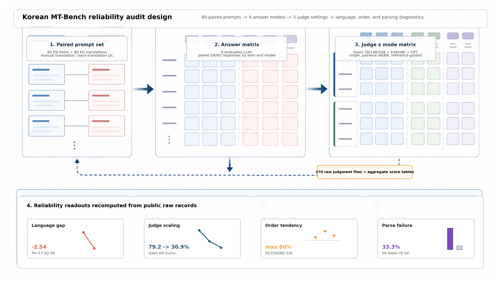
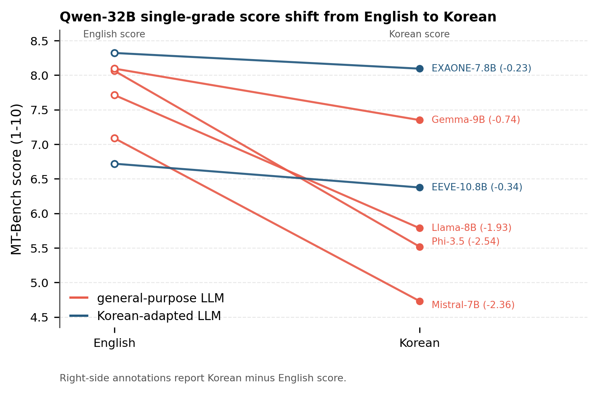
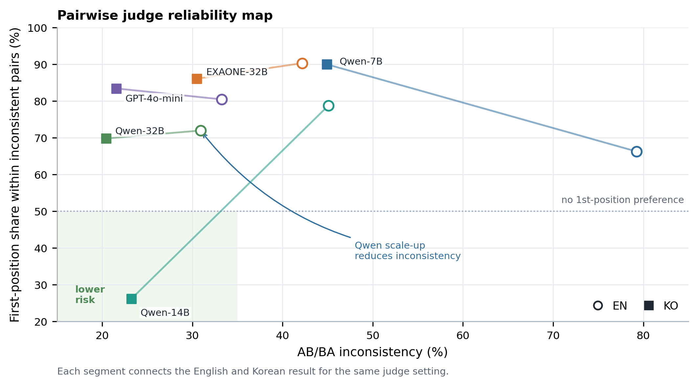
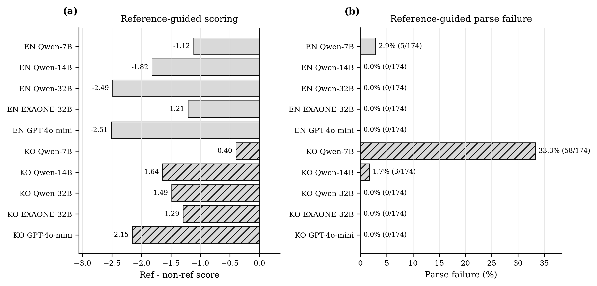

# Korean MT-Bench: Cross-Lingual Reliability and Cross-Family Bias in LLM-as-a-Judge Evaluation

**한국어 제목**: 한국어 MT-Bench: LLM-as-a-Judge의 한·영 신뢰도 및 Cross-Family 편향 분석

> **KIPS 정보처리학회논문지 투고 목표**  
> Base paper: Zheng et al., *Judging LLM-as-a-Judge with MT-Bench and Chatbot Arena*, NeurIPS 2023 ([arXiv:2306.05685](https://arxiv.org/abs/2306.05685))

---

## 핵심 발견

**1. 한국어에서 범용 영어 모델 점수가 급락한다.**  
Qwen-32B 기준 Phi-3.5-mini −2.54, Mistral-7B −2.36. 반면 한국어 특화 모델은 EXAONE −0.23, EEVE −0.34로 하락폭이 작다.

**2. Judge 크기가 클수록 inconsistency가 줄어든다.**  
EN에서 7B→32B: 79.3%→30.9%. KO에서도 동일 패턴(44.9%→20.4%)이지만, KO 14B→32B 감소폭은 2.8%p로 작아 14B 이후 포화 양상이 관찰된다. 소형 judge는 신뢰하기 어렵다.

**3. Cross-family judge는 position bias가 더 강하다.**  
불일치 판정 중 1st-pos bias 비율은 Qwen-32B가 EN 72%, KO 70%인 반면, EXAONE-32B는 EN 90%/KO 86%, GPT-4o-mini는 EN 80%/KO 83%로 더 높다. 패밀리가 다른 judge가 판정에 확신이 없을 때 position heuristic에 더 의존하는 공통 패턴이다.

**4. Reference-guided 채점은 대체로 standard보다 낮다.**
math/coding/reasoning 문항에 한정된 ref 채점 평균이 non-ref보다 낮다. Qwen-32B 기준 차이는 EN −2.49, KO −1.49이며, KO Qwen-7B는 parse failure가 커서 차이가 −0.40으로 작게 관찰된다.

**5. 7B judge는 한국어에서 parse failure가 급증한다.**  
KO single_grade_ref 33.3% — EN 동일 설정에서는 2.9%(약 11배 차이). 소형 judge의 한국어 포맷 준수 능력이 언어에 따라 크게 다르다. GPT-4o-mini는 EN/KO 모두 0~0.2%로 안정적이다.

---

## 연구 개요

MT-Bench는 LLM 능력을 8개 카테고리, 80문항으로 평가하는 대표적 벤치마크다. 원 논문(Zheng et al. 2023)은 영어 환경에서 GPT-4 judge의 높은 신뢰도를 보였으나, **비영어권 언어로 동일 파이프라인을 적용했을 때 judge 신뢰도가 유지되는지**는 검증되지 않았다.

본 연구는 MT-Bench 80문항을 한국어로 번역하고, Qwen2.5 패밀리(7B/14B/32B, same-family), EXAONE-3.5-32B(cross-family, 한국어 특화), GPT-4o-mini(cross-family, 상용) 세 judge 군으로 영어 baseline과 동일 조건에서 실험을 수행한다. Judge 크기 scaling, 언어별 inconsistency/position bias, cross-family 편향, parse failure rate를 정량 비교한다.

---

## 논문용 Figure 및 값 검증 요약

아래 figure는 공개 repo에 commit된 aggregate CSV에서 직접 재생성된다.

```bash
python3 scripts/paper/generate_figures.py
```

> **재현성 주의**: `data/en/judgments/`, `data/ko/judgments/`에는 pairwise, single-grade, reference-guided raw judgment JSONL을 포함한다. 따라서 aggregate CSV뿐 아니라 raw judge output에서도 score, inconsistency, position tendency, parse failure를 재계산할 수 있다. 아래 figure는 논문 삽입용 간결성을 위해 aggregate CSV를 입력으로 사용한다.

Raw judgment 공개 범위는 총 270개 JSONL이다: EN 135개, KO 135개이며, 각 judge 설정(Qwen-7B/14B/32B, EXAONE-32B, GPT-4o-mini)마다 pairwise 15개, single-grade 6개, reference-guided 6개 파일을 포함한다.

| Figure/Table | 용도 | 주요 입력 파일 |
|--------------|------|----------------|
| Fig. 1 | Korean MT-Bench 실험 프로토콜 요약 | `data/en`, `data/ko`, `results*.csv` |
| Fig. 2 | Qwen-32B 기준 EN-KO 점수 하락폭 | `results_phase3_judge_32B.csv`, `results_ko_judge_32B.csv` |
| Fig. 3 | Judge별 inconsistency와 불일치 내부 1st-position share | `results_en_ko_comparison.csv` |
| Fig. 4 | Judge별 reference-guided 평균 차이와 reference-guided parse failure 전체 조건 | raw judgment JSONL, EN/KO `results*.csv` |
| Copy tables | 논문 본문/표에 바로 넣을 핵심 통계 요약 | `paper/tables/kci_tables.md` |

<p align="center">
  
</p>

<p align="center">
  
</p>

<p align="center">
  
</p>

<p align="center">
  
</p>

---

## 연구 진행 상황

| Phase | 논문 섹션 | 내용 | 상태 |
|-------|----------|------|------|
| **Phase 0** | §4 한국어 MT-Bench 구축 | 한국어 번역 + 역번역 validity 검증 (q83·q90·q136 수정) | ✅ 완료 |
| **Phase 1** | §5 실험 설계, §6.1 Judge Scaling, §6.4 Ref, §6.5 Parse | 답변 생성 (6 eval 모델, EN+KO 80문항) + Qwen judge 3종 (7B/14B/32B) | ✅ 완료 |
| **Phase 1b** | §5 실험 설계, §6.3 Cross-family bias, §6.4 Ref, §6.5 Parse | EXAONE-3.5-32B cross-family judge (EN+KO, 한국어 특화) | ✅ 완료 |
| **Phase 1c** | §6.3 Cross-family bias (상용 baseline) | GPT-4o-mini judge (EN+KO) | ✅ 완료 |
| **Phase 2** | §6.2 EN-KO 비교 분석 | compare_en_ko.py 실행 → Judge scaling 재현, inconsistency/bias 정량 비교 | ✅ 완료 |
| **Phase 3** | §7 Discussion, §8 Conclusion | KIPS 원고 작성 및 투고 준비 | ⏳ 진행 중 |

---

## 논문 구조

| 섹션 | 제목 | 핵심 내용 | 데이터 |
|------|------|----------|--------|
| §1 | Introduction | 비영어권 LLM 평가의 judge 신뢰도 문제 제기, 연구 목적 | — |
| §2 | Related Work | MT-Bench 원 논문, position bias 선행 연구, 다국어 LLM 평가 | — |
| §3 | Korean MT-Bench | 80문항 수작업 번역 방법론, validity 검증 (역번역 BLEU + 의미 보존 점수) | `data/ko/questions.jsonl`, validity CSV |
| §4 | Experimental Setup | 6 eval 모델 선정 이유, 3 judge 군 구성, single/pairwise/reference 방식 정의 | `data/en,ko/answers/` |
| §5.1 | Judge Scaling | judge 7B→32B inconsistency 감소, KO 14B saturation, position bias 패턴 | `results_phase3_judge_*.csv`, 불일치 분해 표 |
| §5.2 | EN-KO Score Gap | 범용 영어 모델 −1.93\~−2.54, 한국어 특화 모델 −0.23\~−0.34, 점수 범위 차이로 설명 | EN/KO single_grade |
| §5.3 | Cross-Family Bias | 불일치 내 1st-pos bias: Qwen-32B EN 72%/KO 70%, EXAONE-32B EN 90%/KO 86%, GPT-4o-mini EN 80%/KO 83%, rank agreement | exaone/gpt judge 결과 |
| §5.4 | Reference-Guided | ref 채점이 standard 대비 −1.1\~−2.5점, judge 엄격도 증가, KO 7B parse 33.3% 실패 | single_grade_ref |
| §6 | Discussion | cross-family bias 원인 가설, 소형 judge 한계, Qwen-32B의 GPT-4o 대안 가능성 | — |
| §7 | Conclusion | 한국어 LLM 평가 권고사항 (≥32B judge), 데이터셋 공개 | — |

---

## Phase 0: 한국어 번역 및 품질 검증

### 번역 과정

MT-Bench 원본 80문항(영어)을 한국어 능숙자 4인(학부생)이 분담하여 수작업으로 번역하였다. 8개 카테고리를 1인당 2개 카테고리씩 균등 배분하였다.

| 담당자 | 카테고리 | 문항 수 |
|--------|----------|--------:|
| 번역자 1 | writing, roleplay | 20 |
| 번역자 2 | reasoning, math | 20 |
| 번역자 3 | coding, extraction | 20 |
| 번역자 4 | stem, humanities | 20 |

번역 원칙:
- 문항의 태스크 타입과 제약 조건(단어 수 제한, 형식, 역할)을 그대로 유지
- 수식·코드블록·고유명사는 번역하지 않고 원문 유지
- 단어 카운팅 과제(q136 등)는 영어 passage를 번역하지 않고 지시문만 한국어로 작성

번역 가이드라인: `data/ko/translation_notes.md`

### 번역 품질 검증 (Back-Translation Validity Check)

수작업 번역의 품질을 정량적으로 검증하기 위해 **back-translation 방식**을 사용하였다. KO 번역이 원본 의미를 잘 보존했다면 역번역(KO→EN)도 원본과 유사해야 한다는 원리를 이용한다.

```
원본 EN ──────────────────────────────────┐
    │ (수작업 번역)                        │ 비교
    ↓                                      │
  KO 번역                                  │
    │ (GPT-4o-mini 역번역, temp=0.0)       │
    ↓                                      │
  역번역 EN ────────────────────────────── ┘
              ↓
    BLEU + LLM 3차원 점수
```

Turn2 역번역 시 Turn1 번역 결과를 컨텍스트로 함께 제공하여 "이전 답변 기반으로..." 같은 참조 표현의 번역 정확도를 높였다.

### 평가 지표

| 지표 | 설명 | 범위 |
|------|------|------|
| `bleu_avg` | 역번역 EN과 원본 EN의 4-gram 단어 겹침 (turn1, turn2 평균) | 0~1 |
| `semantic_preservation` | 핵심 의미와 태스크 의도가 보존됐는가 | 1~5 |
| `difficulty_preservation` | 문제 난이도가 동일하게 유지됐는가 | 1~5 |
| `constraint_preservation` | 글자수 제한, 숫자, 형식, 역할 등 제약 조건 보존 여부 | 1~5 |
| `overall_score` | 종합 점수 | 1~5 |
| `needs_manual_check` | 수동 확인 필요 여부 | True/False |

**점수 산출 방식**

GPT-4o-mini에게 원본 EN 문항과 역번역 EN 문항을 함께 제시하고, 두 텍스트를 비교하여 3개 차원을 각각 1~5점으로 채점하도록 지시한다. 모델은 아래 기준에 따라 JSON으로 점수를 반환한다.

| 점수 | 의미 |
|------|------|
| 5 | 완전히 보존됨 |
| 4 | 표현만 다를 뿐 의미와 제약 조건 유지 |
| 3 | 부분적으로 보존; 모델 응답에 영향을 줄 수 있음 |
| 2 | 중요한 정보 또는 제약 조건이 변경됨 |
| 1 | 원본과 실질적으로 다름 |

각 차원(semantic/difficulty/constraint)과 overall_score는 turn1·turn2를 개별 채점한 뒤 평균을 낸다. temperature=0.0으로 고정하여 재현성을 확보하였다.

**`needs_manual_check = True` 판정 기준** (아래 중 하나라도 해당 시):
- 임의의 차원 점수(semantic/difficulty/constraint)가 3 이하
- 숫자, 형식, 역할, 길이 제한 등 constraint가 변경됨
- 태스크 타입이 바뀐 것으로 판단됨 (예: 교정 태스크 → 생성 태스크)
- 역번역이 지시문을 번역하지 않고 수행함

turn1·turn2 중 하나라도 `needs_manual_check=True`이면 해당 문항 전체가 플래그된다.

**한계**: 역번역(GPT-4o-mini)과 채점(GPT-4o-mini)에 동일 모델을 사용하여 단일 모델 편향이 존재할 수 있다. 이를 보완하기 위해 모델 독립적 지표인 BLEU를 교차 검증 지표로 병행하며, 플래그된 문항을 BLEU–LLM 점수 조합에 따라 아래 네 가지 패턴으로 구분하여 판단한다.

| 패턴 | BLEU | LLM | 해석 | 실제 번역 오류? |
|------|------|-----|------|----------------|
| ① 표현 차이 | 낮음 | 높음 | 역번역 모델이 의미는 보존하되 표현만 바꿈(paraphrase) | 아님 |
| ② 실질적 오류 | 낮음 | 낮음 | 의미·태스크·제약이 변형됨. 원문 대조로 번역 오류 vs 역번역 모델 오류 구분 | 일부(q90·q136) |
| ③ 국소 제약 오류 | 높음 | 낮음 | 전체 문장 구조는 유사하나 핵심 단어 하나가 바뀜. BLEU 단독으로는 탐지 불가 | 일부(q83) |
| ④ 혼합 패턴 | 중간 | 혼합 | turn1은 정상이나 turn2에서 역번역 모델이 후속 질문을 오해함 | 아님 |

### 검증 결과 (카테고리별)

| 카테고리 | n | BLEU | Semantic | Difficulty | Constraint | Overall | ⚠ |
|----------|--:|-----:|---------:|-----------:|-----------:|--------:|--:|
| writing | 10 | 0.202 | 4.25 | 4.80 | 4.35 | 4.15 | 4 |
| roleplay | 10 | 0.223 | 4.25 | 4.95 | 4.90 | 4.25 | 2 |
| reasoning | 10 | 0.335 | 3.80 | 4.70 | 4.20 | 3.75 | 4 |
| math | 10 | 0.303 | 4.15 | 4.85 | 3.95 | 3.95 | 7 |
| coding | 10 | 0.351 | 4.25 | 4.95 | 4.75 | 4.20 | 5 |
| extraction | 10 | 0.231 | 3.70 | 4.70 | 4.10 | 3.65 | 8 |
| stem | 10 | 0.316 | 4.55 | 5.00 | 4.95 | 4.55 | 2 |
| humanities | 10 | 0.357 | 4.55 | 5.00 | 4.90 | 4.50 | 2 |

`⚠` = `needs_manual_check=True` 문항 수. extraction(8건)·math(7건)에서 플래그 빈도가 높고, constraint 점수가 낮은 경향이 있다. 이는 turn2의 후속 질문에서 수치·형식 조건이 미묘하게 변형되는 경향이 원인이다.

전체 80문항 중 34개가 `needs_manual_check=True`로 플래그됐으며, 실제 의미 변형이 확인된 **3개 문항**(q83·q90·q136)을 수정하였다. 나머지 31개는 역번역 모델 오류 또는 표현 차이로 판단하여 원본 번역을 유지하였다(패턴① 6건 + 패턴② 유지 4건 + 패턴③ 유지 1건 + 패턴④ 20건 = 31건). 세부 분류는 아래 패턴 분석을 참조.

### BLEU–LLM 패턴 분석

**패턴 ①: BLEU 낮음 + LLM 높음 (단순 paraphrase)** — 6건

역번역 모델이 의미는 충실히 보존하되 어휘·문장 구조를 달리 표현한 경우다. 4-gram 겹침이 낮아 BLEU는 떨어지지만 GPT-4o-mini 채점자는 의미 동일성을 인식하여 높은 점수(overall ≥ 4.0)를 부여한다. q91·q116·q132·q146·q155·q157에서 확인됐다.

> **예시** q116 (math): 수식 표현이 역번역에서 다르게 서술됨. BLEU=0.00, semantic=4, overall=4. 원문 대조 시 번역 정상.

**패턴 ②: BLEU 낮음 + LLM 낮음 (실질적 의미 변형)** — 총 6건 (유지 4건 + 수정 2건)

| q | category | BLEU avg | Overall avg | 진단 | 조치 |
|---|----------|----------|-------------|------|------|
| q87 | writing | 0.18 | 3.0 | turn2에서 "반복" 과제가 "다시 쓰기"로 바뀜 → 역번역 모델 오류, 원문 대조 시 번역 정상 | 유지 |
| **q90** | writing | 0.03 | 3.0 | 영어 원문에는 의도적 문법 오류가 있으나 KO 번역에는 없음 → 교정 태스크 수행 불가 | **수정**: 의도적 문법 오류 5개 삽입 |
| q104 | reasoning | 0.19 | 2.0 | 형제 관계 모호·숫자 변형 → 역번역 모델 오류, 원문 대조 시 번역 정상 | 유지 |
| q131 | extraction | 0.12 | 3.0 | 핵심 구문 바뀜 → 역번역 모델 오류, 원문 대조 시 번역 정상 | 유지 |
| q134 | extraction | 0.22 | 2.5 | 수치·수익 관계 오류 → 역번역 모델 오류, 원문 대조 시 번역 정상 | 유지 |
| **q136** | extraction | 0.00 | 3.0 | 영어 passage가 한국어로 번역되어 영어 단어 카운팅 과제 수행 불가 | **수정**: 영어 passage 원문 복원, 지시문만 한국어 유지 |

역번역 점수가 낮더라도 원문과 직접 대조하여 번역 오류가 없음을 확인한 q87·q104·q131·q134는 유지하였다. LLM 점수가 낮은 것이 항상 번역 오류를 의미하지 않으며, 역번역 모델 자체의 해석 오류일 수 있음을 보여주는 사례다.

**패턴 ③: BLEU 높음 + LLM 낮음 (국소 제약 조건 변형)** — 2건(turn 기준)

| q | turn | BLEU | Overall | 내용 | 조치 |
|---|------|------|---------|------|------|
| **q83** | turn1 | 0.59 | 2 | "200 words" → "200글자". 문장 구조는 거의 동일하여 BLEU=0.59이지만 단어수/글자수 단위 변형으로 제약 조건이 완전히 바뀜 | **수정**: "200단어 미만으로" 복원 |
| q125 | turn1 | 0.84 | 1 | LCM(최소공배수) 문항을 역번역이 LCA(최소공통조상)로 오인. BLEU=0.84로 거의 완전 일치하나 태스크 의도가 뒤바뀜 → 역번역 모델 오류, 원문 확인 시 번역 정상 | 유지 |

패턴 ③은 **BLEU만으로는 탐지 불가능한 오류 유형**의 존재를 보여준다. 문장 전체 구조가 동일하더라도(BLEU↑) 단 한 단어(words→글자, LCM→LCA)의 의미 변형으로 태스크 전체가 달라질 수 있으며, 이는 LLM 채점자만이 식별할 수 있다. BLEU를 단독 지표로 쓰지 않고 LLM 점수와 교차 검증하는 이유가 바로 여기에 있다.

**패턴 ④: Turn 혼합 패턴 (turn1 정상, turn2 역번역 모델 오류)** — 20건

flagged 31건 유지 중 가장 많은 비율을 차지하는 패턴이다. turn1은 BLEU·LLM 모두 정상이나, turn2에서 역번역 모델이 후속 질문을 잘못 해석하여 낮은 점수를 받는 경우다. `needs_manual_check=True` 판정은 turn 단위로 이루어지기 때문에 turn2 단 하나만 점수가 낮아도 문항 전체가 플래그된다.

대부분 math·extraction 카테고리에서 발생한다. turn2는 turn1 답변을 기반으로 하는 후속 질문 구조이기 때문에, 역번역 모델이 문맥 의존적 표현을 처리하는 과정에서 태스크 의도를 바꾸거나 "이전 문제를 참고하라" 같은 표현을 추가한다. 대표적인 오류 유형은 다음과 같다:
- 수식·부등식 표현을 "구하라" → "기술하라"로 변환 (q117, q118)
- 인물 이름 변형 (q109: "Suresh"→"Thresh")
- 맥락에 없는 "이전 문제 참조" 표현 삽입 (q111, q120)
- 관계사 역할 변환 (q110: "aides"↔"supervising teachers")

원문 turn2를 직접 대조하여 번역 오류가 없음을 확인하고 전체 20건 유지하였다.

### 수정 내역

| q | 카테고리 | 문제 | 조치 |
|---|----------|------|------|
| **q83** | writing | "200 words" → "200글자"로 번역되어 단위 변경 | "200단어 미만으로" 수정 |
| **q90** | writing | 영어 텍스트에는 의도적 문법 오류가 있지만 한국어 번역본에는 오류 없음 → KO 모델이 교정 태스크 수행 불가 | 한국어 텍스트에 조사 오류, 시제 오류, 맞춤법 오류 등 5개 의도적 문법 오류 삽입 |
| **q136** | extraction | 영어 passage("Amazon", "river", "you" 카운팅 과제)를 한국어로 번역하여 영어 단어가 사라짐 | 영어 passage 원문 복원, 지시문만 한국어 유지 |

### 실행 방법

```bash
# 1단계: 역번역 생성
export OPENAI_API_KEY="sk-..."
python3 scripts/translate/back_translate.py \
    --provider openai --model gpt-4o-mini

# 2단계: 3차원 validity 채점
python3 scripts/analysis/analyze_translation_validity.py \
    --provider openai --model gpt-4o-mini

# 또는 한 번에 실행
bash scripts/run/local/run_quality_check_local.sh
```

출력 파일:
- `data/ko/results/results_translation_validity.csv` — 문항별 점수 (turn1/turn2 분리)
- `data/ko/results/results_translation_validity_per_category.csv` — 카테고리별 집계

---

## 실험 설계

### Eval 모델 (6종)

| 모델 | 파라미터 | 특징 |
|------|---------|------|
| EXAONE-3.5-7.8B-Instruct | 7.8B | LG AI, 한국어 특화 |
| EEVE-Korean-Instruct-10.8B | 10.8B | SOLAR 기반 한국어 fine-tune |
| gemma-2-9b-it | 9B | Google, 다국어 |
| Llama-3.1-8B-Instruct | 8B | Meta, 범용 영어 |
| Mistral-7B-Instruct-v0.3 | 7B | Mistral AI, 범용 영어 |
| Phi-3.5-mini-Instruct | 3.8B | Microsoft, 범용 영어 |

### Judge 모델

| Judge | 종류 | 상태 |
|-------|------|------|
| Qwen2.5-7B-Instruct | Same-family (scaling) | ✅ 완료 |
| Qwen2.5-14B-Instruct | Same-family (scaling) | ✅ 완료 |
| Qwen2.5-32B-Instruct-AWQ | Same-family (scaling) | ✅ 완료 |
| EXAONE-3.5-32B-Instruct-AWQ | Cross-family (한국어 특화) | ✅ 완료 |
| GPT-4o-mini | Cross-family (상용, Phase 1c) | ✅ 완료 |

Judge 유형은 세 가지다. **Single-grade**: 각 모델 답변을 독립적으로 채점(1~10점). **Pairwise**: 두 모델 답변을 AB, BA 순으로 제시하고 승자를 판정하며 AB/BA 결과가 다르면 `inconsistent`로 처리. **Reference-guided**: math/coding/reasoning 29문항에 한해 참조 정답을 함께 제공하는 single-grade 방식.

---

## EN-KO 점수 비교 (Qwen-32B 기준)

| 모델 | EN | KO | 차이 |
|------|---:|---:|-----:|
| EXAONE-3.5-7.8B | 8.3208 | 8.0938 | **−0.23** |
| EEVE-10.8B | 6.7188 | 6.3750 | **−0.34** |
| gemma-2-9b | 8.0943 | 7.3500 | −0.74 |
| Llama-3.1-8B | 7.7125 | 5.7862 | −1.93 |
| Mistral-7B | 7.0875 | 4.7313 | **−2.36** |
| Phi-3.5-mini | 8.0625 | 5.5187 | **−2.54** |

한국어 특화 모델(EXAONE, EEVE)은 EN→KO 하락폭이 **0.35 이내**로 작다. 범용 영어 모델(Llama, Mistral, Phi)은 **1.93~2.54점 급락**한다. 다국어 모델인 gemma-2-9b는 −0.74로 범용 영어 모델보다 하락폭이 작으며, 다국어 사전학습 비중이 높기 때문으로 추정된다.

### EN 전체 점수 (Single-Grade)

> 80문항 × 2턴 = 160 samples 기준, parse failure(-1.0) 제외 평균

| 모델 | Qwen-7B | Qwen-14B | Qwen-32B | EXAONE-32B | GPT-4o-mini |
|------|--------:|---------:|---------:|-----------:|------------:|
| EXAONE-3.5-7.8B | **8.3812** | **8.5500** | **8.3208** | **8.46** | **8.7250** |
| Phi-3.5-mini | 8.0437 | 8.0875 | 8.0625 | 8.15 | 7.9688 |
| gemma-2-9b | 7.8688 | 8.0312 | 8.0943 | 8.27 | 8.0125 |
| Llama-3.1-8B | 7.8937 | 8.1687 | 7.7125 | 8.16 | 7.8187 |
| Mistral-7B | 7.4500 | 7.4875 | 7.0875 | 7.82 | 7.2062 |
| EEVE-10.8B | 7.1937 | 6.8875 | 6.7188 | 7.45 | 6.8125 |

전 judge에서 EXAONE 1위, EEVE 최하위로 일관된다. GPT-4o-mini judge는 EXAONE를 8.73으로 가장 높게, Qwen 계열 대비 전반적으로 점수가 높은 편이다.

### KO 전체 점수 (Single-Grade)

| 모델 | Qwen-7B | Qwen-14B | Qwen-32B | EXAONE-32B | GPT-4o-mini |
|------|--------:|---------:|---------:|-----------:|------------:|
| EXAONE-3.5-7.8B | **7.6899** | **8.0281** | **8.0938** | **8.3604** | **8.2875** |
| gemma-2-9b | 6.9318 | 7.2767 | 7.3500 | 7.9647 | 7.4528 |
| EEVE-10.8B | 6.6253 | 6.4781 | 6.3750 | 7.4723 | 6.7188 |
| Phi-3.5-mini | 6.4567 | 5.6855 | 5.5187 | 7.0265 | 6.0375 |
| Llama-3.1-8B | 6.3926 | 5.8491 | 5.7862 | 6.9678 | 6.1000 |
| Mistral-7B | 5.4133 | 5.0696 | 4.7313 | 6.3955 | 5.0126 |

EN 대비 순위 변동이 두드러진다. EN에서 3위였던 Phi-3.5-mini가 Qwen-32B 기준 KO 5위로 급락하고, gemma-2-9b가 EN 2위에서 KO 2위를 유지하며 범용 영어 모델 중 가장 강인하다. EXAONE 1위는 EN·KO 모두 전 judge에서 유지된다. GPT-4o-mini는 Qwen-32B와 유사한 모델 서열을 보이며, EXAONE-32B judge처럼 하위 모델에 특별히 관대하지는 않다.

**Cross-family judge의 KO 점수 인플레이션**: EXAONE-32B judge는 KO 채점에서 Qwen-32B 대비 전반적으로 높은 점수를 부여한다. 하위 모델일수록 격차가 크며 **(Mistral +1.66, Phi +1.51, Llama +1.18)**, EN에서의 동일 비교(최대 +0.73)보다 **훨씬 크다**. 한국어 특화 모델인 EXAONE judge가 KO 응답에 더 관대한 기준을 적용하는 cross-family bias 가능성이 있다. 상위 3개 모델과 최하위 모델은 동일하지만, Phi와 Llama의 중간 순위는 judge에 따라 바뀐다.

---

## Judge 신뢰도 — Inconsistency & Position Bias

> - **Inconsistency**: AB/BA 판정 불일치율 (`winner == "inconsistent"`)
> - **1st-pos bias**: `winner_ab=A AND winner_ba=A` — 두 순서 모두 첫 번째 위치 모델 선호
> - **1st-pos (전체)**: 전체 pair 대비 비율 — 원 논문 Table 2 기준
> - **1st-pos (불일치 내)**: 불일치 pair 대비 비율 — 편향의 방향성·강도

### Inconsistency & Position Bias (EN)

| Judge | 총 pair | Inconsistency | 1st-pos (전체) | 1st-pos (불일치 내) |
|-------|--------:|--------------:|---------------:|--------------------:|
| Qwen-7B  | 1,200 | **79.3%** | 52.5% (630) | 66% |
| Qwen-14B | 1,200 | 45.1% | 35.5% (426) | 79% |
| Qwen-32B | 1,200 | 30.9% | 22.2% (267) | 72% |
| EXAONE-32B | 1,200 | 42.2% | **38.1% (457)** | **90%** |
| GPT-4o-mini | 1,200 | 33.2% | 26.8% (321) | 80% |

Qwen judge scaling: 7B→14B에서 34.2%p 감소, 14B→32B에서 14.2%p 추가 감소

### Inconsistency & Position Bias (KO)

| Judge | 총 pair | Inconsistency | 1st-pos (전체) | 1st-pos (불일치 내) |
|-------|--------:|--------------:|---------------:|--------------------:|
| Qwen-7B  | 1,200 | 44.9% | **40.4% (485)** | **90%** |
| Qwen-14B | 1,200 | 23.2% | **6.1% (73)** | 26% |
| Qwen-32B | 1,200 | 20.4% | 14.2% (171) | 70% |
| EXAONE-32B | 1,200 | 30.5% | **26.2% (315)** | **86%** |
| GPT-4o-mini | 1,200 | 21.6% | 18.0% (216) | **83%** |

Qwen judge scaling: 7B→14B에서 21.7%p 감소, 14B→32B에서 2.8%p 추가 감소

---

**Judge 크기와 inconsistency**: Qwen judge에서는 크기가 커질수록 inconsistency가 감소한다. EN에서는 7B→14B와 14B→32B 모두 큰 폭으로 줄어든다. KO에서는 7B→14B 감소폭이 크지만, 14B→32B는 2.8%p 추가 감소에 그쳐 14B 이후 포화 양상이 나타난다. EN vs KO 비교(같은 judge): Qwen-7B Δ=34.3%p, 14B Δ=21.8%p, 32B Δ=10.5%p로, judge가 커질수록 언어 간 inconsistency 차이가 줄어든다.

**EN이 KO보다 inconsistency가 높은 구조적 원인**: Qwen-32B 기준 EN 모델 간 점수 범위는 **6.72~8.32 (range 1.60)** 인 반면, KO는 **4.73~8.09 (range 3.36)** 으로 두 배 이상 넓다. 모델 간 품질 차이가 클수록 판정이 명확해져 inconsistency가 낮아진다. EN에서는 모델들이 비슷한 점수대에 몰려 있어 judge가 순서를 바꿀 때마다 판정이 흔들리기 쉽다.

**Cross-family judges의 공통 패턴**: 두 cross-family judge 모두 Qwen-32B(EN 72%, KO 70%)보다 불일치 내 1st-pos bias 비율이 높다. EXAONE-32B: **EN 90%, KO 86%**, GPT-4o-mini: **EN 80%, KO 83%**. EXAONE-32B는 Qwen-32B와 같은 32B급 judge이면서도 더 강한 position tendency를 보이며, GPT-4o-mini도 상용 baseline으로서 유사한 방향성을 보인다. 다만 GPT-4o-mini의 파라미터 규모는 공개되어 있지 않으므로 크기 효과가 아니라 judge family/학습 방식 차이로 조심스럽게 해석한다.

**KO Qwen-14B**: 불일치 내 1st-pos 26%, **2nd-pos 40%** — **유일하게 2nd-pos가 우세한 케이스**. tie 혼합도 34%로 높아, 이 judge의 KO 실패는 position bias가 아닌 "판정 불능" 패턴이다.

**KO 14B→32B 감소폭이 작은 이유** (Δ=2.8%p): 불일치 건수는 279→245건(12.2%)으로 소폭 감소했으나, 실패 양상이 질적으로 달라 net 변화가 작다.

| 불일치 유형 | KO Qwen-14B (279건) | KO Qwen-32B (245건) |
|------------|--------------------:|--------------------:|
| 1st-pos bias | 73건 (26%) | 171건 (70%) |
| 2nd-pos bias | 112건 (40%) | 57건 (23%) |
| tie 혼합 | 94건 (34%) | 17건 (7%) |

14B는 판정 불능(tie 혼합 34%, 방향 없음)이 주된 실패 원인인 반면, 32B는 자신있게 판정하되 **불일치의 70%가 체계적인 1st-pos bias로 쏠린다** (14B: 26% → 32B: 70%).

### 불일치 내부 유형 전체 분해

> **1st-pos**: 두 순서 모두 첫 번째 위치 선택 (체계적 편향) / **2nd-pos**: 두 번째 위치 (역방향) / **tie 혼합**: 한 쪽만 tie (판정 불능)  
> 괄호 안 % = 불일치 내 비율

| 언어 | Judge | 총 pair | 불일치 (율) | 1st-pos | 2nd-pos | tie 혼합 |
|------|-------|--------:|----------:|--------:|--------:|---------:|
| EN | Qwen-7B | 1,200 | 951 (79.3%) | 630 (**66%**) | 18 (2%) | 303 (32%) |
| EN | Qwen-14B | 1,200 | 541 (45.1%) | 426 (**79%**) | 41 (8%) | 74 (14%) |
| EN | Qwen-32B | 1,200 | 371 (30.9%) | 267 (**72%**) | 52 (14%) | 52 (14%) |
| EN | EXAONE-32B | 1,200 | 506 (42.2%) | 457 (**90%**) | 34 (7%) | 15 (3%) |
| EN | GPT-4o-mini | 1,200 | 399 (33.2%) | 321 (**80%**) | 69 (17%) | 9 (2%) |
| KO | Qwen-7B | 1,200 | 539 (44.9%) | 485 (**90%**) | 37 (7%) | 17 (3%) |
| KO | Qwen-14B | 1,200 | 279 (23.2%) | 73 (26%) | 112 (**40%**) | 94 (34%) |
| KO | Qwen-32B | 1,200 | 245 (20.4%) | 171 (**70%**) | 57 (23%) | 17 (7%) |
| KO | EXAONE-32B | 1,200 | 366 (30.5%) | 315 (**86%**) | 32 (9%) | 19 (5%) |
| KO | GPT-4o-mini | 1,200 | 259 (21.6%) | 216 (**83%**) | 35 (14%) | 8 (3%) |

**EN Qwen-7B**: 불일치 951건 중 tie 혼합 **303건(32%)** — 불일치의 1/3이 판정 불능이다. "첫 번째 모델 선호"가 아닌 **"판정 능력 자체가 없어 랜덤에 가깝다"** 가 올바른 해석이다.

**KO Qwen-7B**: 불일치 539건 중 1st-pos 485건(90%) — EN 7B(66%)와 달리 KO에서는 실패가 거의 전부 position bias 형태다. KO 모델 간 품질 격차가 커서 대부분은 잘 판정하나, 틀릴 때는 체계적으로 position에 끌린다.

**EN Qwen-32B vs 논문 GPT-4**: consistency 69.1% vs 논문 65.0%. 직접 비교는 불가 — 원 논문은 의도적으로 구분하기 어려운 GPT-3.5 답변 쌍을 사용했고, 우리는 6개 모델의 실제 답변을 비교한다. 모델 간 품질 차이가 클수록 consistency가 높아지는 것은 자연스럽다.

---

## Reference-guided vs Standard 채점 차이

> Reference-guided(single_grade_ref): math/reasoning/coding 29문항에 참조 정답 제공, turn2만 채점  
> Standard(single_grade): 참조 정답 없이 전체 80문항 채점  
> diff = ref_mean − nonref_mean (turn2 기준)
> 아래 표는 고정 benchmark 조건에서 관찰된 평균 차이를 보고한다.

| 언어 | Judge | Non-ref | Ref | 차이 |
|------|-------|--------:|----:|-----:|
| EN | Qwen-7B | 7.84 | 6.72 | −1.12 |
| EN | Qwen-14B | 7.82 | 6.00 | −1.82 |
| EN | Qwen-32B | 7.67 | 5.18 | −2.49 |
| EN | EXAONE-32B | 7.93 | 6.72 | −1.21 |
| EN | GPT-4o-mini | 7.81 | 5.30 | **−2.51** |
| KO | Qwen-7B | 6.91 | 6.51 | −0.40 |
| KO | Qwen-14B | 6.32 | 4.68 | −1.64 |
| KO | Qwen-32B | 6.35 | 4.87 | −1.49 |
| KO | EXAONE-32B | 7.33 | 6.04 | −1.29 |
| KO | GPT-4o-mini | 6.70 | 4.55 | **−2.15** |

Reference-guided 채점은 대부분 조건에서 standard보다 낮다. 다만 ref 문항이 math/coding/reasoning — 객관적 정답이 있고 채점이 까다로운 문항 — 에 한정되므로, reference 제공 효과와 문항 난이도 효과가 완전히 분리되지는 않는다. KO Qwen-7B는 parse failure가 커서 차이가 −0.40으로 작게 관찰된다.

**Judge별 특이점**: GPT-4o-mini는 EN에서 −2.51로 전체 EN judge 중 최대 차이를 보인다(Qwen-32B −2.49와 거의 동등). KO에서도 −2.15로 Qwen 계열(−1.49~−1.64)보다 크다. 이 모델은 참조 정답 제공에 크게 반응하는 편이다. 반면 EXAONE-32B는 EN −1.21, KO −1.29로 cross-family 중 가장 차이가 작다. 한국어 특화 학습 또는 judge calibration 차이의 영향일 수 있으나, 현재 aggregate CSV만으로 원인을 단정할 수는 없다.

KO Qwen-7B의 차이(−0.40)가 작은 것은 7B judge의 한국어 ref 파싱 실패(33.3%)로 유효 샘플이 116건으로 감소한 결과다. 살아남은 샘플이 파싱 성공 편향(easier questions)을 가져 ref 점수가 비정상적으로 높게 나타난다.

---

## Parse Failure

Parse failure = judge가 `[[N]]` 형식 점수를 출력하지 않아 집계에서 제외된 경우(−1.0 처리).

> 집계 CSV의 `coverage` 컬럼은 문항 수 기준 coverage라서 `1.0000`이어도 parse failure가 없다는 뜻은 아니다. 실제 parse failure는 `n_samples / (expected_count × 2)`(single-grade) 또는 `n_samples / expected_count`(reference-guided)로 확인해야 한다.

### EN Parse Failure

| Judge | Type | 실패 | 전체 | 실패율 |
|-------|------|-----:|-----:|-------:|
| Qwen-7B | single_grade_ref | 5 | 174 | 2.9% |
| Qwen-32B | single_grade | 2 | 960 | 0.2% |
| Qwen-32B | pairwise | 2 | 2,400 | 0.1% |
| EXAONE-32B | single_grade | 6 | 960 | 0.6% |

영어에서는 parse failure가 전반적으로 낮다. Qwen-7B의 reference-guided 채점에서 2.9%로 가장 높고, 나머지는 0.7% 미만이다. GPT-4o-mini는 EN에서 parse failure가 전무(0/960, 0/174)하다.

### KO Parse Failure

| Judge | Type | 실패 | 전체 | 실패율 |
|-------|------|-----:|-----:|-------:|
| Qwen-7B | single_grade | 45 | 960 | **4.7%** |
| Qwen-7B | single_grade_ref | 58 | 174 | **33.3%** |
| Qwen-7B | pairwise | 4 | 2,400 | 0.2% |
| Qwen-14B | single_grade | 5 | 960 | 0.5% |
| Qwen-14B | single_grade_ref | 3 | 174 | 1.7% |
| Qwen-32B | single_grade | 1 | 960 | 0.1% |
| Qwen-32B | pairwise | 1 | 2,400 | 0.0% |
| EXAONE-32B | single_grade | 32 | 960 | **3.3%** |
| EXAONE-32B | single_grade_ref | 0 | 174 | 0.0% |
| EXAONE-32B | pairwise | 0 | 2,400 | 0.0% |
| GPT-4o-mini | single_grade | 2 | 960 | 0.2% |
| GPT-4o-mini | single_grade_ref | 0 | 174 | 0.0% |

Qwen-7B의 KO single_grade_ref **33.3%** 는 이 연구의 핵심 발견 중 하나다. 한국어 프롬프트에서 소형 judge가 포맷 지시를 따르지 못하거나 중국어로 응답하는 사례가 급증한다. EN 동일 설정(2.9%)과 비교하면 **약 11배 차이**다. Qwen-32B는 KO에서도 0.1% 이하로 안정적이다.

EXAONE-32B의 KO single_grade parse failure **3.3%** 는 EN 동일 설정(6/960=0.6%)의 **약 5배**다. 32B 크기임에도 불구하고 한국어 채점 프롬프트에서 포맷 지시 준수율이 저하되는 현상으로, cross-family judge의 언어별 응답 성향 차이를 반영한다. 카테고리별로는 extraction(9건)·writing(7건)·stem(5건)에 집중되며, 짧은 답변 평가나 긴 지시문 포맷에서 실패율이 높다. single_grade_ref와 pairwise에서는 실패가 없어, 프롬프트 구조가 다른 채점 유형에서는 정상 동작함을 확인하였다.

---

## Phase 2: EN-KO 비교 분석 결과

> `python3 scripts/translate/compare_en_ko.py` 출력 기준  
> 출력 CSV: `data/ko/results/results_en_ko_comparison.csv`

### [비교 1] Judge별 EN/KO 모델 랭킹 상관관계 (Spearman ρ)

| Judge | EN Top-3 | KO Top-3 | ρ |
|-------|----------|----------|--:|
| Qwen-7B | EXAONE > Phi > Llama | EXAONE > gemma > EEVE | 0.37 |
| Qwen-14B | EXAONE > Llama > Phi | EXAONE > gemma > EEVE | 0.37 |
| Qwen-32B | EXAONE > gemma > Phi | EXAONE > gemma > EEVE | **0.60** |
| EXAONE-32B | EXAONE > gemma > Llama | EXAONE > gemma > EEVE | **0.60** |
| GPT-4o-mini | EXAONE > gemma > Phi | EXAONE > gemma > EEVE | **0.60** |

소형 judge(7B/14B)는 EN/KO 모델 랭킹 상관관계가 낮다(ρ=0.37). Qwen-32B, EXAONE-32B, GPT-4o-mini에서는 모두 ρ=0.60으로 관찰되며, 이 6개 모델 집합에서는 더 안정적인 랭킹을 보인다. 다만 표본 모델 수가 6개라 Spearman ρ 해석은 보수적으로 해야 한다.

모든 judge에서 EXAONE이 EN·KO 공통 1위다. 2·3위 변동이 크게 나는 이유는 Phi/Llama가 EN에서는 강하지만 KO에서 급락(−1.9~−2.5점)하기 때문이다. gemma-2-9b는 다국어 사전학습 비중이 높아 KO에서도 2위를 유지한다.

### [비교 2] Inconsistency & 1st-pos Bias — EN vs KO

| Judge | EN Incon | KO Incon | Δ(KO−EN) | EN 1st-pos | KO 1st-pos |
|-------|--------:|---------:|----------:|-----------:|-----------:|
| Qwen-7B | 79.2% | 44.9% | **−34.3%p** | 52.5% | 40.4% |
| Qwen-14B | 45.1% | 23.2% | **−21.8%p** | 35.5% | 6.1% |
| Qwen-32B | 30.9% | 20.4% | −10.5%p | 22.2% | 14.2% |
| EXAONE-32B | 42.2% | 30.5% | −11.7%p | 38.1% | 26.2% |
| GPT-4o-mini | 33.2% | 21.6% | −11.7%p | 26.8% | 18.0% |

모든 judge에서 KO inconsistency가 EN보다 낮다. 7B/14B의 Δ가 큰 것은 소형 judge가 EN에서 판정 능력 부족으로 랜덤에 가까운 판정을 했을 가능성과, KO에서 모델 간 품질 격차가 커져 판정이 더 명확해졌을 가능성을 함께 시사한다. 32B급 및 상용 baseline에서는 Δ가 −10~−12%p로 수렴하며, 이 차이는 KO 모델 간 점수 범위(4.73~8.09, range 3.36)가 EN(6.72~8.32, range 1.60)의 2배 이상 넓다는 관찰과 일관된다.

### [비교 3] Top-20 변별 문항 기준 EN/KO 랭킹 Spearman ρ

> Top-20 문항 선별 기준: EN single_grade(Qwen-32B)에서 모델 간 점수 분산이 가장 높은 문항  
> 카테고리 분포: coding 7건, math 6건, reasoning 3건, roleplay 3건, extraction 1건

| Judge | ρ (Top-Disc) | ρ (전체 80문항) |
|-------|-------------:|----------------:|
| Qwen-7B | **0.89** | 0.37 |
| Qwen-14B | 0.43 | 0.37 |
| Qwen-32B | **0.89** | 0.60 |
| EXAONE-32B | **0.89** | 0.60 |
| GPT-4o-mini | 0.60 | 0.60 |

변별력 높은 문항(주로 coding·math)으로 제한하면 EN/KO 랭킹 상관관계가 크게 높아진다. Qwen-7B조차 전체 ρ=0.37에서 Top-Disc ρ=0.89로 급등한다. 이는 coding·math·reasoning 중심 문항에서 번역 후에도 변별력 구조가 상당 부분 유지된다는 보조 증거다. 다만 Top-Disc 문항은 EN Qwen-32B 기준으로 선별되었고 표본 모델 수가 작으므로 독립 검증으로 보강할 필요가 있다.

GPT-4o-mini는 Top-Disc에서도 ρ=0.60으로 전체와 동일하다. Top-Disc 문항에서도 랭킹이 이미 안정적이어서 추가 이득이 없는 것으로 해석된다.

Qwen-14B의 Top-Disc ρ=0.43은 KO에서의 14B 이상 현상(2nd-pos bias 우세, 판정 불능 34%)이 coding·math 등 변별 문항에서도 여전히 남아있음을 반영한다.

---

## Base Paper 비교 (Zheng et al. 2023)

| 지표 | 원 논문 (GPT-4 judge) | 본 연구 (EN Qwen-32B) | 본 연구 (EN GPT-4o-mini) |
|------|---------------------:|--------------------:|------------------------:|
| Inconsistency (1 − consistency) | **35.0%** (Table 2) | 30.9% | 33.2% |
| 1st-position bias (전체 pair 기준) | **30.0%** (Table 2) | 22.2% (267/1,200) | 26.8% (321/1,200) |
| Judge-model agreement (vs human, S2) | **85%** (non-tie) | — | — |

원 논문은 GPT-4 judge로 **유사 성능 GPT-3.5 쌍**(구분하기 어렵게 설계된 쌍)을 평가한 반면, 본 연구는 성능 차이가 다양한 6개 실제 eval 모델의 전체 pair(C(6,2)=15쌍)를 평가한다. 평가 쌍의 성능 차이가 클수록 판정이 명확해져 inconsistency가 낮아지는 구조적 이유로, 수치의 직접 비교는 참고 수준이다.

이 점을 감안하면 EN GPT-4o-mini(33.2%)가 원 논문 GPT-4(35.0%)와 수치상 근접하고, 1st-pos bias(26.8% vs 30.0%)도 비슷하다는 점은 주목할 만하다. 다만 평가 쌍 구성과 human agreement 검증이 다르므로 직접적인 성능 동등성으로 해석해서는 안 된다. Qwen-32B(30.9%)와 GPT-4o-mini(33.2%)는 본 실험의 EN inconsistency에서 근접하며, 오픈소스 32B judge가 비용 효율적인 baseline이 될 가능성을 제시한다.

---

## 프로젝트 구조

```
mt_bench_repro/
├── data/
│   ├── en/
│   │   ├── answers/                      # eval 모델 6개 답변 (git 추적)
│   │   ├── judgments/qwen/               # Qwen raw judge JSONL (git 추적)
│   │   ├── judgments/exaone/             # EXAONE-32B raw judge JSONL (git 추적)
│   │   ├── judgments/gpt/                # GPT-4o-mini raw judge JSONL (git 추적)
│   │   └── results/                      # 집계 CSV (git 추적)
│   └── ko/
│       ├── questions.jsonl               # 한국어 번역 80문항
│       ├── translation_notes.md
│       ├── answers/                      # KO eval 모델 답변 (git 제외)
│       ├── judgments/qwen/               # Qwen raw judge JSONL (git 추적)
│       ├── judgments/exaone/             # EXAONE-32B raw judge JSONL (git 추적)
│       ├── judgments/gpt/                # GPT-4o-mini raw judge JSONL (git 추적)
│       └── results/                      # KO judge 집계 CSV + EN/KO 비교 결과
├── scripts/
│   ├── run/a100/
│   │   ├── run_generate_phase3_a100.sh   # EN 답변 생성 (완료)
│   │   ├── run_judge_phase3_a100.sh      # EN Qwen judge (완료)
│   │   ├── run_generate_ko_a100.sh       # KO 답변 생성 (완료)
│   │   ├── run_judge_ko_a100.sh          # KO Qwen judge (완료)
│   │   ├── run_judge_exaone32b_a100.sh   # EN+KO EXAONE judge (완료)
│   │   └── run_ko_full_a100.sh           # KO 전체 파이프라인
│   ├── run/local/
│   │   ├── run_mock_full.sh              # 로컬 mock smoke test
│   │   ├── run_quality_check_local.sh    # 번역 품질 검증
│   │   └── run_judge_gpt_local.sh        # GPT-4o-mini judge (로컬 실행)
│   ├── analysis/
│   │   └── analyze_translation_validity.py
│   ├── paper/
│   │   └── generate_figures.py           # KIPS용 figure/table 재생성
│   ├── translate/
│   │   ├── validate_translation.py
│   │   ├── back_translate.py
│   │   └── compare_en_ko.py              # Phase 2: EN vs KO 비교
│   └── tools/
│       └── download_dataset.sh
├── paper/
│   ├── figures/                          # KIPS 논문용 figure PNG/PDF
│   ├── tables/                           # 본문 삽입용 copy tables
│   └── README.md                         # figure/table 사용 안내
└── src/mtbench_repro/                    # 핵심 Python 패키지
```

---

## 로컬 실행

```bash
git clone <repo> && cd mt_bench_repro
pip install -r requirements.txt
export PYTHONPATH=src

# mock 파이프라인 테스트
bash scripts/run/local/run_mock_full.sh

# README/논문용 figure 재생성
python3 scripts/paper/generate_figures.py
# → paper/figures/*.png, paper/figures/*.pdf, paper/tables/kci_tables.md

# 번역 validity 검증 (GPT-4o-mini API 키 필요)
python3 scripts/translate/back_translate.py \
    --provider openai --model gpt-4o-mini --api-key $KEY
python3 scripts/analysis/analyze_translation_validity.py \
    --provider openai --model gpt-4o-mini --api-key $KEY
```

---

## 인용

```bibtex
@inproceedings{zheng2023judging,
  title     = {Judging LLM-as-a-Judge with MT-Bench and Chatbot Arena},
  author    = {Zheng, Lianmin and Chiang, Wei-Lin and Sheng, Ying and others},
  booktitle = {Advances in Neural Information Processing Systems},
  year      = {2023}
}
```
