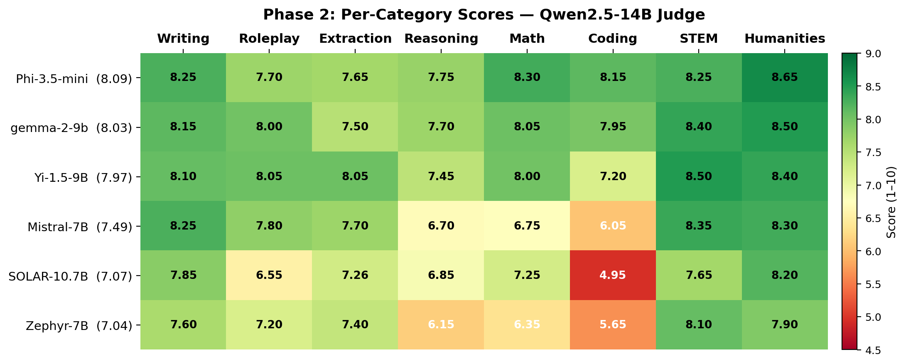
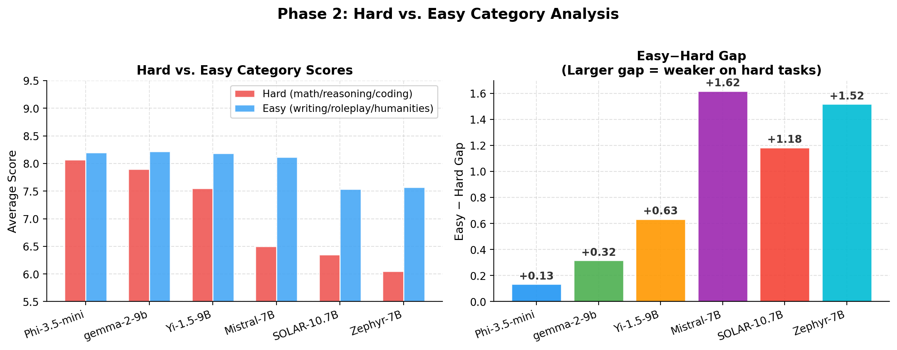
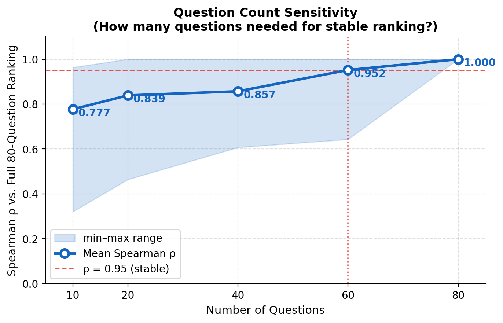

<div align="center">

# MT-Bench 재현

**NeurIPS 2023 논문 _"Judging LLM-as-a-Judge with MT-Bench and Chatbot Arena"_ 재현**

[](https://www.python.org/)
[](LICENSE)
[](https://arxiv.org/abs/2306.05685)
[](https://www.nvidia.com/)
[](CITATION.cff)

</div>

---

> **목표:** NeurIPS 2023 MT-Bench 논문의 *모델 서열*과 *카테고리별 성능 추이*를 오픈소스 모델(2024–2025 세대)과 로컬 vLLM judge로 재현.
> 정확한 점수 일치는 목표가 아님.

<br>

<p align="center">
  
</p>

---

## 목차

- [개요](#개요)
- [실험 설정](#실험-설정)
- [Phase 1 — Self-Judge 기준선](#phase-1--self-judge-기준선)
- [Phase 2 — 6개 모델 비교](#phase-2--6개-모델-비교)
  - [Single-Answer 점수](#single-answer-점수)
  - [카테고리별 히트맵](#카테고리별-히트맵)
  - [Hard vs. Easy 갭](#hard-vs-easy-갭)
  - [Pairwise 승률](#pairwise-승률)
  - [변별도 기반 갭 분석](#phase-2--변별도-기반-갭-분석)
- [Phase 3 — Judge 스케일링 법칙](#phase-3--judge-스케일링-법칙)
  - [Inconsistency율 곡선](#inconsistency율-곡선)
  - [Judge 크기별 점수](#judge-크기별-점수)
  - [Cross-Judge Spearman ρ](#cross-judge-spearman-ρ)
  - [문항 수 민감도](#문항-수-민감도)
- [tinyMT-Bench — 최소 변별 문항 세트 발굴](#tinymT-bench--최소-변별-문항-세트-발굴)
- [Turn 1 vs Turn 2 성능 저하 분석](#turn-1-vs-turn-2-성능-저하-분석)
- [원본 논문과 비교](#원본-논문과-비교)
- [결론](#결론)
- [저장소 구조](#저장소-구조)
- [빠른 시작](#빠른-시작)
- [인용](#인용)

---

## 개요

이 저장소는 [Zheng et al. (NeurIPS 2023)](https://arxiv.org/abs/2306.05685)의 평가 파이프라인을 독립적인 Python 패키지(`mtbench_repro`)로 재구현한다. 실험은 3단계로 구성된다:

| Phase | 설명 | 평가 모델 | Judge | 상태 |
|-------|------|----------|-------|------|
| **1** | 파이프라인 검증, self-judge 기준선 | Qwen2.5-7B | Qwen2.5-7B (self) | ✅ 완료 |
| **2** | 6개 모델 비교, 외부 judge | 6개 오픈소스 모델 | Qwen2.5-14B | ✅ 완료 |
| **3** | Judge 스케일링 법칙 (7B → 32B) | 7개 모델 (Phase 2 + Llama-3.1-8B) | Qwen2.5 7B / 14B / 32B | ✅ 완료 |

논문의 평가 프로토콜에 맞춰 **3가지 채점 방식**을 구현했다:

| 방식 | 논문 근거 | 적용 범위 |
|------|----------|----------|
| Single-answer grading (1–10점) | Figure 6, Table 8 | 전 카테고리 |
| Pairwise 비교 (AB/BA swap) | Figure 5, 9, §3.4 | 전 카테고리 |
| Reference-guided grading | Figure 8, 10 | math / reasoning / coding |

---

## 실험 설정

### 평가 대상 모델

| Phase | 모델 | 파라미터 | 비고 |
|-------|------|---------|------|
| 1 | Qwen2.5-7B-Instruct | 7B | Self-judge 기준선 전용 |
| 2, 3 | **Phi-3.5-mini-Instruct** | 3.8B | Microsoft |
| 2, 3 | **gemma-2-9b-it** | 9B | Google |
| 2, 3 | **Yi-1.5-9B-Chat** | 9B | 01.AI |
| 2, 3 | **Mistral-7B-Instruct-v0.3** | 7B | Mistral AI |
| 2, 3 | **SOLAR-10.7B-Instruct** | 10.7B | Upstage |
| 2, 3 | **Zephyr-7B-beta** | 7B | HuggingFace H4 |
| 3 전용 | **Llama-3.1-8B-Instruct** | 8B | Meta (Qwen2.5-7B 대체) |

### Judge 모델

| Judge | 파라미터 | VRAM | 양자화 | 사용 Phase |
|-------|---------|------|--------|-----------|
| Qwen2.5-7B-Instruct | 7B | ~14 GB | fp16 | Phase 1 (self), Phase 3 |
| Qwen2.5-14B-Instruct | 14B | ~28 GB | fp16 | Phase 2, Phase 3 |
| Qwen2.5-32B-Instruct | 32B | ~20 GB | AWQ 4-bit | Phase 3 |
| Qwen2.5-72B-Instruct | 72B | ~39 GB | AWQ 4-bit | ❌ A100 40GB OOM |

> Phase 3 judge를 Qwen2.5 단일 패밀리로 통일 → 아키텍처 변수를 제거하고 순수 크기 효과만 측정.

### 인프라

- **GPU:** NVIDIA A100 SXM4 40 GB
- **서빙:** vLLM v0.6.6 (OpenAI 호환 API)
- **벤치마크:** MT-Bench 80문항 × 2턴 = 모델당 160턴 채점
- **생성 temperature:** 0.7 · **Judge temperature:** 0.0 (greedy)

---

## Phase 1 — Self-Judge 기준선

> **모델:** Qwen2.5-7B-Instruct · **Judge:** Qwen2.5-7B-Instruct (자기 자신)

<p align="center">
  
</p>

| 카테고리 | 점수 |
|---------|------|
| Writing | 7.60 |
| Roleplay | 7.95 |
| Extraction | 7.45 |
| Reasoning | 7.20 |
| Math | **8.80** |
| Coding | **8.80** |
| STEM | 8.55 |
| Humanities | 8.60 |
| **전체** | **8.12** |

**관찰:** Self-judge는 Qwen2.5-7B가 가장 강한 Math와 Coding 점수를 과대평가(8.80)한다. 이 self-judge 편향이 Phase 2에서 외부 judge를 사용하는 동기가 된다.

---

## Phase 2 — 6개 모델 비교

> **Judge:** Qwen2.5-14B-Instruct · **인프라:** A100 40GB vLLM

### Single-Answer 점수

<p align="center">
  
</p>

| 순위 | 모델 | 파라미터 | 전체 | Writing | Roleplay | Extraction | Reasoning | Math | Coding | STEM | Humanities |
|------|------|---------|------|---------|----------|-----------|----------|------|--------|------|-----------|
| 1 | Phi-3.5-mini-Instruct | 3.8B | **8.09** | 8.25 | 7.70 | 7.65 | 7.75 | 8.30 | 8.15 | 8.25 | 8.65 |
| 2 | gemma-2-9b-it | 9B | 8.03 | 8.15 | 8.00 | 7.50 | 7.70 | 8.05 | 7.95 | 8.40 | 8.50 |
| 3 | Yi-1.5-9B-Chat | 9B | 7.97 | 8.10 | 8.05 | 8.05 | 7.45 | 8.00 | 7.20 | 8.50 | 8.40 |
| 4 | Mistral-7B-Instruct-v0.3 | 7B | 7.49 | 8.25 | 7.80 | 7.70 | 6.70 | 6.75 | 6.05 | 8.35 | 8.30 |
| 5 | SOLAR-10.7B-Instruct | 10.7B | 7.07 | 7.85 | 6.55 | 7.26 | 6.85 | 7.25 | 4.95 | 7.65 | 8.20 |
| 6 | Zephyr-7B-beta | 7B | 7.04 | 7.60 | 7.20 | 7.40 | 6.15 | 6.35 | 5.65 | 8.10 | 7.90 |

> Qwen2.5-7B는 self-judge 편향 방지를 위해 Phase 2에서 제외 (Phase 1 self-judge 전체 점수: 8.12).

---

### 카테고리별 히트맵

<p align="center">
  
</p>

Coding과 Reasoning이 가장 변별력 높은 카테고리다. Phi-3.5-mini가 Math/Coding에서 선두; SOLAR-10.7B와 Zephyr-7B는 Coding에서 크게 뒤처진다 (4.95, 5.65).

---

### Hard vs. Easy 갭

<p align="center">
  
</p>

| 모델 | Hard 평균<br>(math / reasoning / coding) | Easy 평균<br>(writing / roleplay / humanities) | 갭 (Easy − Hard) |
|------|--------|--------|-------|
| Phi-3.5-mini | 8.07 | 8.20 | +0.13 |
| gemma-2-9b | 7.90 | 8.22 | +0.32 |
| Yi-1.5-9B | 7.55 | 8.18 | +0.63 |
| Mistral-7B | 6.50 | 8.12 | **+1.62** |
| SOLAR-10.7B | 6.35 | 7.53 | +1.18 |
| Zephyr-7B | 6.05 | 7.57 | **+1.52** |

**논문 핵심 패턴 재현:** 강한 모델일수록 Hard/Easy 갭이 작다. Mistral-7B와 Zephyr-7B는 Writing 점수는 준수하나 Hard 카테고리에서 크게 뒤처진다.

---

### Pairwise 승률

| 순위 | 모델 | 승률 | 게임 수 |
|------|------|------|--------|
| 1 | gemma-2-9b-it | **79.4%** | 209 |
| 2 | Phi-3.5-mini-Instruct | 76.3% | 219 |
| 3 | Yi-1.5-9B-Chat | 66.1% | 202 |
| 4 | Mistral-7B-Instruct-v0.3 | 43.4% | 206 |
| 5 | SOLAR-10.7B-Instruct | 25.2% | 214 |
| 6 | Zephyr-7B-beta | 15.2% | 244 |

Single ↔ Pairwise Spearman ρ = **0.943** — 전반적으로 수렴하나 주목할 예외: 상위 2위 순위 역전 (Single: Phi > gemma; Pairwise: gemma > Phi). 3–6위는 동일.

> Pairwise inconsistency율: **46.1%** (553 / 1200) — GPT-4 추정치(~20%)보다 현저히 높음. 14B judge의 position bias 한계.

---

## Phase 2 — 변별도 기반 갭 분석

> **연구 질문:** "Hard"를 고정 카테고리 레이블(math/reasoning/coding) 대신 *모델 간 점수 분산*으로 정의하면 무엇이 보이는가?

### 방법론

80개 MT-Bench 문항 각각에 대해 **6개 모델 점수의 표준편차(std)**를 계산한다.
Std가 높은 문항 = 모델 간 점수 격차가 큰 실질적 변별 문항.
이 데이터 기반 순위를 논문의 레이블 기반 hard/easy 분류(math/reasoning/coding = hard)와 비교한다.

<p align="center">
  
</p>

### 주요 결과

**카테고리별 평균 변별도 (데이터 기반 순위):**

| 순위 | 카테고리 | 평균 Std | 논문 레이블 |
|------|---------|---------|-----------|
| 1 | coding | **1.864** | hard |
| 2 | **extraction** | **1.291** | **easy ⚠️** |
| 3 | math | 1.277 | hard |
| 4 | reasoning | 1.092 | hard |
| 5 | **roleplay** | **0.776** | **easy** |
| 6 | stem | 0.562 | easy |
| 7 | writing | 0.482 | easy |
| 8 | humanities | 0.472 | easy |

**Top-20 변별도 상위 문항 카테고리 분포:**

| 카테고리 | Top-20 내 개수 | 비고 |
|---------|--------------|------|
| coding | 8 | hard ✅ |
| reasoning | 4 | hard ✅ |
| math | 4 | hard ✅ |
| **extraction** | **3** | **easy 레이블이지만 과대표** ⚠️ |
| roleplay | 1 | easy |

### 해석

1. **논문 레이블 80% 타당:** Top-20 변별 문항 중 16개(80%)가 math/reasoning/coding — 균등 분포 기대값(37.5%)의 2배 이상. 레이블 기반 분류는 경험적으로 근거 있음.

2. **Extraction은 숨겨진 Hard 카테고리:** 평균 변별도 2위(1.291) — math(1.277)와 reasoning(1.092)보다 높음. 논문은 "easy"로 분류했지만 실제 모델 간 점수 격차가 더 큼.

3. **Writing / Humanities는 진짜 쉬운 문항:** 평균 std 0.47–0.48로 최하위. 모든 모델 점수가 밀집 → 모델 변별에 거의 기여하지 않음.

4. **낮은 평균 점수 ≠ 높은 변별도:** extraction q136(평균 점수 7.58)처럼 평균이 높아도 변별도가 클 수 있음 — 난이도와 변별도는 별개 차원.

> **결론:** 벤치마크를 데이터 기반으로 재설계한다면 extraction에서 2–3개 문항을 "hard" pool로 이동하고 writing/humanities 비중을 줄이는 것이 합리적이다. MT-Bench 80문항 설계는 대체로 잘 조율되어 있으나, extraction이 체계적으로 "easy"로 과소평가되고 있다.

---

## Phase 3 — Judge 스케일링 법칙

> **평가 모델:** Phase 2 라인업(6개) + Llama-3.1-8B-Instruct (Qwen2.5-7B 대체)
> **Judge:** Qwen2.5-7B / 14B / 32B (단일 패밀리, 크기만 변수)

### Inconsistency율 곡선

<p align="center">
  
</p>

| Judge | 파라미터 | Inconsistency율 | Clear Decision율 | 점수 범위 |
|-------|---------|----------------|----------------|---------|
| Qwen2.5-7B | 7B | **78.75%** | 21.25% | 0.84pt |
| Qwen2.5-14B | 14B | 46.85% | 53.15% | 1.13pt |
| Qwen2.5-32B | 32B | **32.86%** | 67.14% | 1.47pt |

Judge 크기가 7B → 32B로 커지면서 pairwise inconsistency가 **45.9pp 감소** (단조 감소). 큰 judge일수록 더 *변별력*이 높음 — 점수 범위가 0.84pt에서 1.47pt로 확대.

> **Qwen2.5-72B:** AWQ 4-bit 웨이트 자체가 ~38.95 GB를 차지해 A100 40GB에서 vLLM 활성화 메모리 공간 부재. 4차례 시도 모두 OOM. 스케일링 커브에서 제외.

---

### Judge 크기별 점수

<p align="center">
  
</p>

| 순위 | 모델 | Judge 7B | Judge 14B | Judge 32B | 평균 |
|------|------|----------|-----------|-----------|------|
| 1 | Phi-3.5-mini-Instruct | 8.04 | 8.09 | 8.06 | **8.06** |
| 2 | gemma-2-9b-it | 7.87 | 8.03 | 8.09 | 7.99 |
| 3 | Llama-3.1-8B-Instruct | 7.89 | 8.17 | 7.71 | 7.92 |
| 4 | Yi-1.5-9B-Chat | 7.98 | 7.97 | 7.79 | 7.91 |
| 5 | Mistral-7B-Instruct-v0.3 | 7.45 | 7.49 | 7.09 | 7.34 |
| 6 | SOLAR-10.7B-Instruct | 7.34 | 7.07 | 7.02 | 7.14 |
| 7 | Zephyr-7B-beta | 7.20 | 7.04 | 6.62 | 6.95 |

파싱 실패율: **0 / 560 (0%)** — 3가지 judge 모두 완벽한 데이터 품질.

---

### Cross-Judge Spearman ρ

<p align="center">
  
</p>

| | Judge 7B | Judge 14B | Judge 32B |
|--|---------|-----------|-----------|
| **Judge 7B** | — | 0.821 | 0.786 |
| **Judge 14B** | 0.821 | — | 0.750 |
| **Judge 32B** | 0.786 | 0.750 | — |

모델 순위는 judge 크기와 무관하게 **안정적으로 보존됨** (모든 쌍 ρ > 0.75). 상위(Phi/gemma)와 하위(Zephyr) 포지션은 어떤 judge를 써도 일관됨.

---

### 문항 수 민감도

<p align="center">
  
</p>

| 문항 수 | 평균 Spearman ρ | 최소 | 최대 |
|--------|---------------|------|------|
| 10 | 0.777 | 0.321 | 0.964 |
| 20 | 0.839 | 0.464 | 1.000 |
| 40 | 0.857 | 0.607 | 1.000 |
| **60** | **0.952** | 0.643 | 1.000 |
| 80 | 1.000 | — | — |

**60문항 이상**(ρ ≥ 0.95)에서 순위가 안정된다. 10문항에서는 순위 신뢰도가 매우 낮음(최소 ρ = 0.32). MT-Bench의 80문항 설계는 경험적으로 잘 조율된 규모임을 실증.

---

## tinyMT-Bench — 최소 변별 문항 세트 발굴

> **연구 질문:** 변별도 상위 N개 문항만으로 80문항 전체와 동일한 모델 순위를 얻을 수 있는가?
> "변별도 기반 선택" vs "랜덤 선택" 중 어느 쪽이 더 빠르게 순위에 수렴하는가?

### 배경

MT-Bench는 80개 문항으로 모델을 평가한다. 하지만 모든 문항이 동등하게 유용하지는 않다.
이전 변별도 분석에서 문항별로 inter-model std를 계산했는데, 이 std가 높을수록 모델 간 점수 격차가 크다 — 즉 모델을 잘 구별하는 문항이다.

**핵심 아이디어:** std가 낮은 문항(writing, humanities)은 모든 모델이 비슷한 점수를 받아 순위 파악에 거의 기여하지 않는다. 반면 std가 높은 문항(coding, math)은 단 몇 개만으로도 모델 서열을 드러낸다.

### 왜 변별도 높은 문항이 효율적인가

**낮은 변별도 문항 예시 (writing)**
```
"하와이 여행 블로그를 작성하시오." (std ≈ 0.25)

  Phi-3.5:  8.25   gemma:  8.15   Yi:     8.10
  Mistral:  8.25   SOLAR:  7.85   Zephyr: 7.60

→ 다들 비슷하게 잘 함 → 이 문항만으로 순위 구분 불가
```

**높은 변별도 문항 예시 (coding #128)**
```
"알고리즘을 구현하시오." (std ≈ 2.96)

  Phi-3.5:  9.0   gemma:  7.5   Yi:     6.5
  Mistral:  7.0   SOLAR:  2.0   Zephyr: 2.0

→ 상위/하위 모델이 극명하게 갈림 → 문항 하나로 서열이 드러남
```

### 방법

```
for N in [5, 10, 15, 20, 25, 30, 40, 60, 80]:
    방법 A (Random):   80문항 중 무작위 N개 선택 → 200회 반복 → ρ 평균/min/max
    방법 B (Top-Disc): 변별도 상위 N개 고정 선택 → ρ 1회 계산
    기준: 80문항 전체 순위와의 Spearman ρ
```

<p align="center">
  
</p>

### 핵심 결과

| N 문항 | Random 평균 ρ | Random 최악 ρ | Top-Disc ρ | 이득 |
|--------|-------------|-------------|-----------|------|
| 5 | 0.632 | −0.714 | **0.943** | **+0.311** |
| 10 | 0.793 | −0.200 | 0.886 | +0.092 |
| **15** | 0.843 | −0.086 | **1.000** | +0.157 |
| 20 | 0.857 | +0.429 | 0.943 | +0.085 |
| 30 | 0.879 | +0.429 | 1.000 | +0.121 |
| 40 | 0.911 | +0.714 | 1.000 | +0.089 |
| 60 | 0.959 | +0.771 | 1.000 | +0.041 |

**ρ ≥ 0.95 달성 최소 문항 수:**

| 선택 방식 | 필요 문항 수 | 80문항 대비 절감 |
|----------|------------|--------------|
| **Top-Disc** | **15개** | **81% 절감** |
| Random (평균) | 60개 | 25% 절감 |

### 결과 해석

**① 변별도 기반 선택의 압도적 우위**

랜덤으로 60개를 뽑아야 겨우 얻는 신뢰도(ρ=0.959)를, Top-Disc는 **15개**만으로 달성(ρ=1.000)한다. 어떤 N에서도 Top-Disc가 Random 평균보다 항상 높거나 같다.

**② 랜덤 선택의 치명적 불안정성**

N=5에서 Random의 최악 ρ = **−0.714** — 운이 나쁘면 순위가 완전히 뒤집힌다. writing 문항 5개만 뽑히면 모든 모델 점수가 비슷해 순위를 전혀 구분하지 못하기 때문이다. Top-Disc는 고정 문항이므로 이런 분산이 없다.

**③ N이 커질수록 이득이 줄어드는 이유**

N이 작을수록 "어떤 문항을 고르느냐"가 순위에 결정적인 영향을 미친다. N이 커지면 랜덤도 다양한 카테고리를 포함하게 되어 두 방법의 격차가 자연스럽게 줄어든다.

**④ Panel (C): N=20 모델별 점수 비교**

TopDisc-20으로 뽑은 점수 프로파일이 Full-80과 거의 동일(ρ=0.943)하다. Random-20은 단 1회 시행만으로도 일부 모델 점수가 크게 달라지는 것을 확인할 수 있다.

### 요약

> **MT-Bench 80문항 중 변별도 상위 15개만 골라 평가해도 전체 80개로 평가한 것과 순위가 완전히 일치한다(ρ=1.000). 랜덤으로 동일 신뢰도를 얻으려면 60개가 필요하다 — Top-Disc가 4배 효율적이다.**

벤치마크를 새로 설계한다면 변별도 상위 15~20개 문항만으로 평가 비용을 4~5배 절감하면서도 모델 서열 파악 목적을 충분히 달성할 수 있다.

---

## Turn 1 vs Turn 2 성능 저하 분석

**연구 질문:** 멀티턴 대화에서 모델별·카테고리별 Turn 2 품질 저하 패턴은 어떻게 다른가?

기존 분석은 Turn 1과 Turn 2 점수를 평균하여 집계했다. 분리해서 보면 가려져 있던 멀티턴 robustness 패턴이 드러난다.


### 주요 발견

#### 모델별 Overall δ (Turn2 − Turn1)

| 모델 | δ | 해석 |
|------|---|------|
| SOLAR-10.7B-Instruct | **−0.622** | 멀티턴 가장 취약 |
| Zephyr-7B-beta | −0.387 | 두 번째로 취약 |
| Mistral-7B-Instruct | −0.150 | 소폭 저하 |
| Phi-3.5-mini-Instruct | −0.075 | 거의 유지 |
| Yi-1.5-9B-Chat | −0.062 | 거의 유지 |
| Llama-13b / Vicuna-13b | ±0.000 | 완전 유지 |
| gemma-2-9b-it | +0.088 | 소폭 향상 |
| Qwen2.5-7B-Instruct | **+0.113** | Turn 2 실제로 향상 |

#### 카테고리별 평균 δ

| 카테고리 | 평균 δ | 예상 vs 실제 |
|---------|--------|------------|
| **Reasoning** | **+0.511** | 예상 외 — Turn 2 follow-up에서 더 깊은 사고 유도 |
| **Coding** | **+0.300** | 예상 외 — Turn 2 구체화 요청에서 오히려 향상 |
| Humanities | −0.129 | 예상대로 소폭 저하 |
| Roleplay | −0.157 | 예상대로 소폭 저하 |
| STEM | −0.171 | 예상대로 소폭 저하 |
| Extraction | −0.325 | 중간 저하 |
| **Writing** | **−0.533** | 창의적 지속 능력 저하 |
| **Math** | **−0.578** | 가장 큰 저하 — Turn 2 수식 복잡도 증가 |

### 해석

**예상과 달랐던 부분:** Math 저하는 예상대로였으나, Coding과 Reasoning은 Turn 2에서 오히려 *상승*했다. Turn 2 Coding 문항은 주로 "코드를 수정하라" 형태라 Turn 1보다 구체적인 지시를 제공하는 효과가 있고, Reasoning Turn 2는 "왜 그렇게 생각했는지 설명하라"는 심화 질문으로 모델의 추론 능력을 더 끌어내는 것으로 보인다.

**멀티턴 robustness 프로파일:** 점수가 비슷한 모델 사이에서도 멀티턴 내구성이 다르다. Phi-3.5-mini(Overall 1위)는 δ=−0.075로 거의 유지되는 반면 SOLAR(Overall 5위)는 δ=−0.622로 대화가 길어질수록 품질이 급격히 떨어진다.

> **결론:** Overall 점수만 보면 놓치는 정보가 있다. **멀티턴 사용 환경에서는 Turn 2 저하율이 모델 선택의 중요한 기준이 된다.**

---

## 원본 논문과 비교

| 지표 | 원본 (GPT-4 judge, 2023) | 이번 재현 (Qwen judge, 2026) |
|------|--------------------------|------------------------------|
| 점수 범위 | 2.61 – 8.99 **(6.38pt)** | 7.04 – 8.09 (1.05pt) |
| Hard/Easy 갭 패턴 | ✅ 상위 모델일수록 갭 작음 | ✅ 동일하게 재현 |
| Single ↔ Pairwise 수렴 | ✅ | ⚠️ 부분 재현 — ρ=0.943, 상위 2위 역전 |
| Pairwise inconsistency율 | ~20% (추정) | 46.1% (14B) → 32.9% (32B) |
| 파싱 실패율 | — | **0%** 전 Phase |

**점수가 압축된 이유:** 2025년 세대 오픈소스 모델들은 원본 논문의 2023년 모델(GPT-4, LLaMA-13B, Vicuna-13B)보다 전반적으로 성능이 높다. 모든 평가 모델이 고점수 구간(7.0–8.1)에 밀집되어 점수 범위가 6.38pt에서 ~1.05pt로 축소됨.

---

## 결론

| 논문의 주장 | 재현 결과 |
|------------|----------|
| Hard 카테고리에서 모델 간 격차가 더 크다 | ✅ 갭 +0.13pt (Phi) ~ +1.62pt (Mistral) |
| Single-answer와 Pairwise 순위가 수렴한다 | ⚠️ 부분 재현 — ρ=0.943; 상위 2위 역전 |
| LLM-as-a-Judge로 모델 서열을 신뢰성 있게 식별할 수 있다 | ⚠️ 조건부 재현 — 서열은 안정적이나 inconsistency 46% (14B judge) |
| 모델 크기가 클수록 반드시 성능이 높지 않다 | ✅ SOLAR-10.7B (5위) < Phi-3.5-mini-3.8B (1위) |

### Phase 3 추가 발견

| 발견 | 결과 |
|------|------|
| Judge 크기 증가 → inconsistency 감소 | ✅ 7B(78.75%) → 14B(46.85%) → 32B(32.86%), 단조 감소 |
| Judge 크기와 무관한 모델 서열 안정성 | ✅ Cross-judge ρ > 0.75 전 쌍 |
| Judge 크기 증가 → 변별력 증가 | ✅ 점수 범위 0.84pt (7B) → 1.47pt (32B) |
| Qwen2.5-72B AWQ, A100 40GB | ❌ OOM — 웨이트만 ~39GB |

### Judge 선택 권고

| 사용 목적 | 최소 Judge 권고 |
|----------|---------------|
| 빠른 모델 서열 파악 | 14B (inconsistency < 50%) |
| 세밀한 순위 / 연구 목적 | 32B (clear decision ~67%) |
| 사용 비권장 | 7B (position bias 지배, inconsistency 78.75%) |

---

## 논문–코드 대응

| 논문 | 구현 위치 | 설명 |
|------|----------|------|
| Figure 5 | `prompts._SYSTEM_PAIRWISE` | Pairwise 기본 프롬프트 |
| Figure 6 | `prompts._SYSTEM_SINGLE` | Single grading 프롬프트 |
| Figure 7 | `prompts._SYSTEM_PAIRWISE_MATH_COT` | CoT pairwise |
| Figure 8 | `prompts._SYSTEM_PAIRWISE_REFERENCE` | Reference-guided pairwise |
| Figure 9 | `prompts.build_multiturn_pairwise_prompt` | Multi-turn pairwise |
| Figure 10 | `prompts.build_multiturn_single_prompt` | Reference-guided multi-turn single |
| Section 3.4 | `judge_pairwise.judge_pairwise_question` | Conservative swap (AB=BA일 때만 winner) |
| Table 8 | `aggregate.compute_single_scores` | MT-Bench Score (160턴 평균) |

---

## 저장소 구조

```
mt_bench_repro/
├── src/mtbench_repro/
│   ├── schemas.py          # 데이터 클래스 (MTBenchQuestion, ModelAnswer, JudgmentSingle, …)
│   ├── io_utils.py         # JSONL 스트리밍 I/O, resume 지원
│   ├── client.py           # ChatClient (vLLM / OpenAI API / mock)
│   ├── prompts.py          # Judge 프롬프트 (Figure 5–10) + 점수 파서
│   ├── generate.py         # 2-turn 답변 생성, resume 지원
│   ├── judge_single.py     # Single-answer grading (Fig. 6)
│   ├── judge_pairwise.py   # Pairwise 비교, AB/BA swap (Fig. 5/9)
│   ├── judge_reference.py  # Reference-guided grading (Fig. 8/10)
│   ├── aggregate.py        # 집계, 모델 랭킹, pairwise 행렬
│   └── cli.py              # 통합 CLI (5개 서브커맨드)
├── scripts/
│   ├── run_mock_full.sh                  # GPU 없이 전체 흐름 검증
│   ├── run_generate_multi_a100.sh        # Phase 2: 6개 모델 답변 생성
│   ├── run_judge_multi_a100.sh           # Phase 2: judge + 집계
│   ├── run_generate_phase3_a100.sh       # Phase 3: Llama-3.1-8B 답변 생성
│   ├── run_judge_phase3_a100.sh          # Phase 3: judge 3종 순차 실행
│   ├── analyze_phase3.py                 # Judge 스케일링 + 문항 수 분석
│   ├── analyze_discriminability.py       # 변별도 기반 갭 분석
│   └── generate_figures.py              # 이 README의 모든 figure 재생성
├── data/
│   ├── mt_bench_questions.jsonl          # MT-Bench 80문항 (2턴)
│   ├── answers/                          # 모델 답변 (모델당 JSONL 1개)
│   ├── judgments/                        # Phase 2 판정 결과
│   ├── judgments_phase3/judge_{7B,14B,32B}/   # Phase 3 판정 (judge별 분리)
│   ├── results_multi.csv                 # Phase 2 집계 점수
│   ├── results_phase3_judge_{7B,14B,32B}.csv
│   ├── results_phase3_qsize.csv
│   └── results_discriminability.csv      # 문항별 변별도 (std, 순위)
└── figures/                              # 논문 수준 figure 전체
```

---

## 빠른 시작

### 설치

```bash
git clone https://github.com/kook222/mt_bench_repro.git
cd mt_bench_repro
pip install -r requirements.txt
export PYTHONPATH=src
```

### Mock 파이프라인 (GPU 불필요)

```bash
bash scripts/run_mock_full.sh
```

### CLI 서브커맨드

```bash
# 1. 답변 생성 (localhost:8000에서 vLLM 실행 필요)
python -m mtbench_repro.cli generate \
  --questions data/mt_bench_questions.jsonl \
  --answers-dir data/answers/ \
  --model-id Phi-3.5-mini-Instruct \
  --vllm-host localhost --vllm-port 8000

# 2. Single-answer grading
python -m mtbench_repro.cli judge-single \
  --questions data/mt_bench_questions.jsonl \
  --answers-dir data/answers/ \
  --output-dir data/judgments/ \
  --model-id Phi-3.5-mini-Instruct \
  --judge-model Qwen2.5-14B-Instruct \
  --openai-base-url http://localhost:8000/v1 \
  --openai-api-key EMPTY

# 3. Pairwise 비교 (AB + BA)
python -m mtbench_repro.cli judge-pairwise \
  --questions data/mt_bench_questions.jsonl \
  --answers-dir data/answers/ \
  --output-dir data/judgments/ \
  --model-a Phi-3.5-mini-Instruct \
  --model-b gemma-2-9b-it \
  --judge-model Qwen2.5-14B-Instruct \
  --openai-base-url http://localhost:8000/v1 \
  --openai-api-key EMPTY

# 4. Reference-guided grading (math / reasoning / coding)
python -m mtbench_repro.cli judge-reference \
  --questions data/mt_bench_questions.jsonl \
  --answers-dir data/answers/ \
  --output-dir data/judgments/ \
  --mode single \
  --model-id Phi-3.5-mini-Instruct \
  --judge-model Qwen2.5-14B-Instruct \
  --openai-base-url http://localhost:8000/v1 \
  --openai-api-key EMPTY

# 5. 집계
python -m mtbench_repro.cli aggregate \
  --judgments-dir data/judgments/ \
  --output-csv data/results.csv

# 6. Figure 전체 재생성
python3 scripts/generate_figures.py
```

> 항상 `PYTHONPATH=src python -m mtbench_repro.cli …` 형태로 실행. `python src/…/cli.py` 직접 실행은 import 오류 발생.

### A100 전체 파이프라인

```bash
# Phase 2
bash scripts/run_generate_multi_a100.sh   # 6개 모델 답변 생성
bash scripts/run_judge_multi_a100.sh      # judge + 집계

# Phase 3
bash scripts/run_generate_phase3_a100.sh  # Llama-3.1-8B만 신규 생성 (나머지 6개 재사용)
bash scripts/run_judge_phase3_a100.sh     # judge 7B → 14B → 32B 순차 (~12–20시간)

# 분석
export PYTHONPATH=src
python3 scripts/analyze_phase3.py
python3 scripts/analyze_discriminability.py
```

---

## 인용

이 저장소를 사용한다면 원본 논문도 함께 인용해주세요:

```bibtex
@inproceedings{zheng2023judging,
  title     = {Judging {LLM}-as-a-Judge with {MT}-Bench and Chatbot Arena},
  author    = {Zheng, Lianmin and Chiang, Wei-Lin and Sheng, Ying and Zhuang, Siyuan
               and Wu, Zhanghao and Zhuang, Yonghao and Lin, Zi and Li, Zhuohan
               and Li, Dacheng and Xing, Eric and Zhang, Hao and Gonzalez, Joseph E.
               and Stoica, Ion},
  booktitle = {Advances in Neural Information Processing Systems},
  year      = {2023}
}
```

```bibtex
@misc{mtbench_repro,
  title  = {{MT-Bench} 재현},
  author = {Park, Seunghyun},
  year   = {2026},
  url    = {https://github.com/kook222/mt_bench_repro}
}
```

---

<div align="center">
<sub>인프라: A100 SXM4 40GB · 서빙: vLLM v0.6.6 · Judge 패밀리: Qwen2.5</sub>
</div>
