<div align="center">

# 영어 Baseline 실험 결과

**MT-Bench 재현 + 확장: Judge 선택이 모델 랭킹을 바꾸는가?**

[](https://www.python.org/)
[](https://arxiv.org/abs/2306.05685)
[](https://www.nvidia.com/)

</div>

---

## 연구 질문 및 핵심 발견

| RQ | 질문 | 핵심 발견 |
|----|------|---------|
| **RQ1** | Judge 선택이 모델 랭킹을 얼마나 바꾸는가? | Kendall τ 최대 0.190 — Llama-3.1-8B가 Qwen-14B에서 1위, Qwen-32B에서 4위 |
| **RQ2** | Judge가 클수록 더 신뢰할 수 있는가? | 불일치율 78.75%→46.85%→32.86% 단조 감소, 잔여 불일치는 더 순서 민감 |
| **RQ3** | Turn 2가 구조적으로 더 어려운가? | Reasoning/Math에서 Turn 2 점수 유의미하게 하락 |
| **RQ4** | 외부 judge로도 랭킹이 유지되는가? | Qwen-32B ↔ GPT-4o-mini: ρ=0.964, τ=0.048 → 대형 오픈소스 judge는 GPT에 수렴 |

---

## 실험 설계

### Judge 모델

| Judge | 크기 | 결과 파일 |
|-------|------|----------|
| Qwen2.5-7B-Instruct | 7B | `data/en/results/results_phase3_judge_7B.csv` |
| Qwen2.5-14B-Instruct | 14B | `data/en/results/results_phase3_judge_14B.csv` |
| Qwen2.5-32B-Instruct-AWQ | 32B | `data/en/results/results_phase3_judge_32B.csv` |
| InternLM2.5-7B-Chat | 7B | `data/en/results/results_phase4_judge_internlm7b.csv` |
| InternLM2.5-20B-Chat | 20B | `data/en/results/results_phase4_judge_internlm20b.csv` |
| GPT-4o-mini | API | `data/en/results/results_phase5_gpt4omini.csv` |

### Eval 모델 (7개)

Llama-3.1-8B-Instruct · gemma-2-9b-it · Yi-1.5-9B-Chat · Phi-3.5-mini-Instruct · Mistral-7B-Instruct-v0.3 · SOLAR-10.7B-Instruct · Zephyr-7B-beta

---

## RQ1: Judge별 모델 랭킹

<p align="center">
  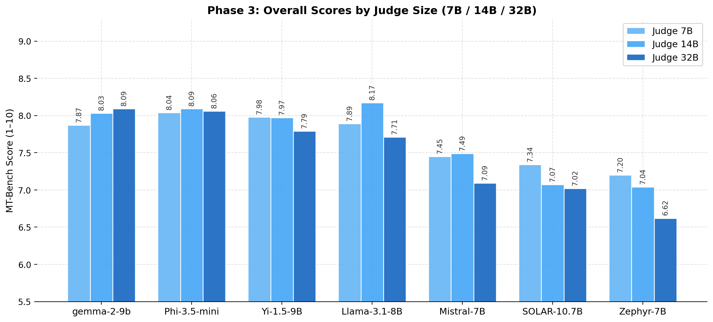
</p>

**Fig 1. Judge별 모델 점수 비교** — 동일 모델도 judge에 따라 순위가 크게 달라진다.

| 순위 | Qwen-7B | Qwen-14B | Qwen-32B | GPT-4o-mini |
|:---:|---------|---------|---------|------------|
| 1 | Phi-3.5-mini (8.04) | **Llama-3.1-8B (8.17)** | **gemma-2-9b (8.09)** | Phi-3.5-mini (7.98) |
| 2 | Yi-1.5-9B (7.98) | Phi-3.5-mini (8.09) | Phi-3.5-mini (8.06) | gemma-2-9b (7.96) |
| 3 | Llama-3.1-8B (7.89) | gemma-2-9b (8.03) | Yi-1.5-9B (7.79) | Yi-1.5-9B (7.78) |
| 4 | gemma-2-9b (7.87) | Yi-1.5-9B (7.97) | **Llama-3.1-8B (7.71)** | Llama-3.1-8B (7.76) |
| 5 | Mistral-7B (7.45) | Mistral-7B (7.49) | Mistral-7B (7.09) | Mistral-7B (7.20) |
| 6 | SOLAR-10.7B (7.34) | SOLAR-10.7B (7.07) | SOLAR-10.7B (7.02) | SOLAR-10.7B (6.82) |
| 7 | Zephyr-7B (7.20) | Zephyr-7B (7.04) | Zephyr-7B (6.62) | Zephyr-7B (6.66) |

Llama-3.1-8B: Qwen-14B 1위(8.17) → Qwen-32B 4위(7.71). 같은 모델, 같은 답변, judge만 다름.

### Judge 간 랭킹 일치도

<p align="center">
  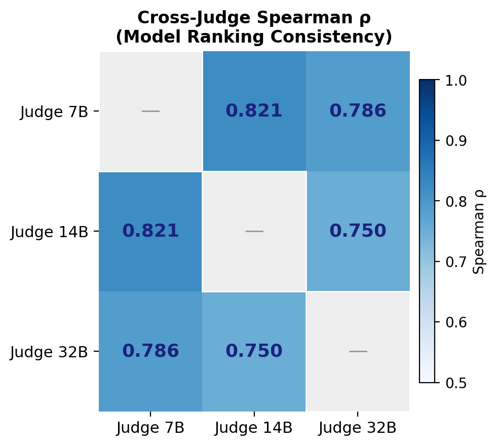
</p>

**Fig 2. Judge 간 Spearman ρ 히트맵**

| | Qwen-7B | Qwen-14B | Qwen-32B | GPT-4o-mini |
|---|:---:|:---:|:---:|:---:|
| **Qwen-7B** | 1.000 | 0.821 | 0.786 | 0.893 |
| **Qwen-14B** | 0.821 | 1.000 | 0.750 | 0.786 |
| **Qwen-32B** | 0.786 | 0.750 | 1.000 | **0.964** |
| **GPT-4o-mini** | 0.893 | 0.786 | **0.964** | 1.000 |

Kendall τ distance 행렬 — 값이 클수록 불일치:

| | Qwen-7B | Qwen-14B | Qwen-32B | GPT-4o-mini |
|---|:---:|:---:|:---:|:---:|
| **Qwen-7B** | 0.000 | 0.143 | 0.143 | 0.095 |
| **Qwen-14B** | 0.143 | 0.000 | **0.190** | 0.143 |
| **Qwen-32B** | 0.143 | **0.190** | 0.000 | **0.048** |
| **GPT-4o-mini** | 0.095 | 0.143 | **0.048** | 0.000 |

### 카테고리별 랭킹 불안정성

<p align="center">
  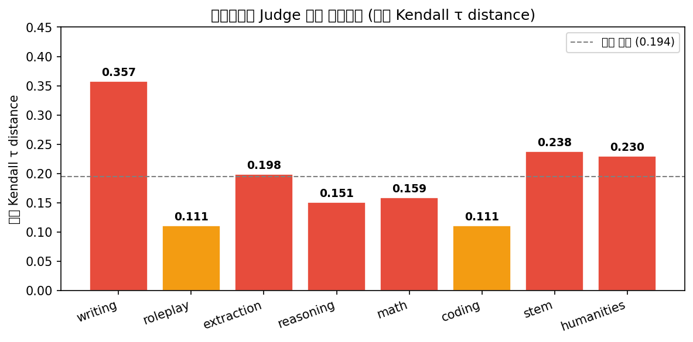
</p>

**Fig 3. 카테고리별 Judge 랭킹 불안정도** — Writing(τ=0.191)이 가장 불안정, Coding(τ=0.083)이 가장 안정적.

### 모델별 Judge 민감도

<p align="center">
  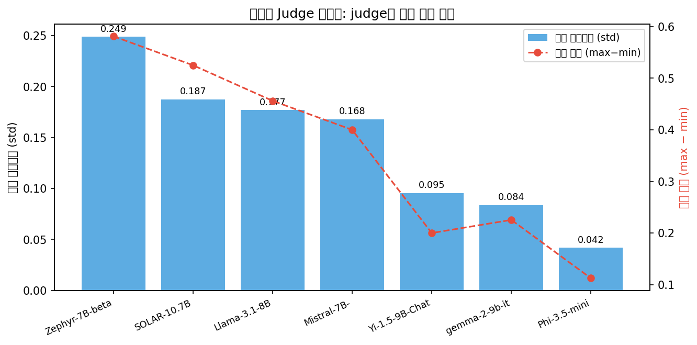
</p>

**Fig 4. 모델별 Judge 민감도** — Llama-3.1-8B가 가장 민감(std=0.177), Phi-3.5-mini가 가장 안정적(std=0.042).

---

## RQ2: Judge 크기 스케일링

<p align="center">
  
</p>

**Fig 5. Judge 크기별 pairwise 불일치율 및 position bias**

| Judge | 불일치율 | decisive율 | First-pos 승률 | Position bias |
|-------|---------|-----------|--------------|--------------|
| Qwen-7B | 78.75% | 21.25% | 84.2% | 0.342 |
| Qwen-14B | 46.85% | 53.15% | 93.5% | 0.435 |
| Qwen-32B | 32.86% | 66.96% | 94.9% | 0.449 |
| GPT-4o-mini | 33.99% | 66.01% | 99.7% | — |

Judge가 클수록 불일치율은 감소하지만, 남은 불일치는 더 순서 민감해짐.

### Position Bias 분석

<p align="center">
  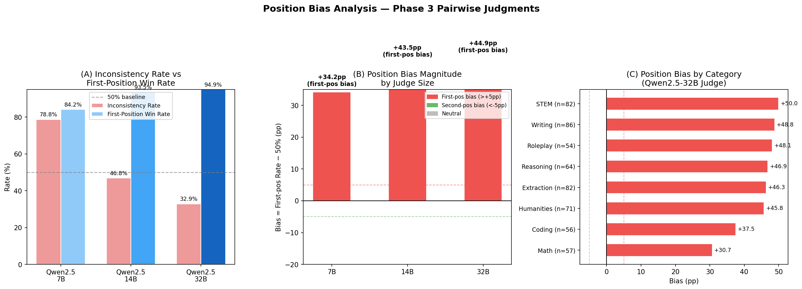
</p>

**Fig 6. 카테고리별 Position Bias** — 카테고리별로 편향 패턴이 다르며, judge 크기와 비선형 관계.

### Reference-guided 채점의 효과

<p align="center">
  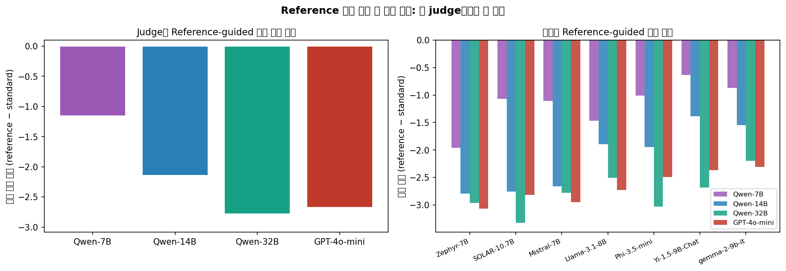
</p>

**Fig 7. Reference 정답 제공 시 점수 변화** — Judge가 클수록 reference 제공 시 점수 하락 폭이 큼 (Qwen-7B: −1.2 → Qwen-32B: −2.7).

---

## RQ3: Turn 2 구조적 난이도

<p align="center">
  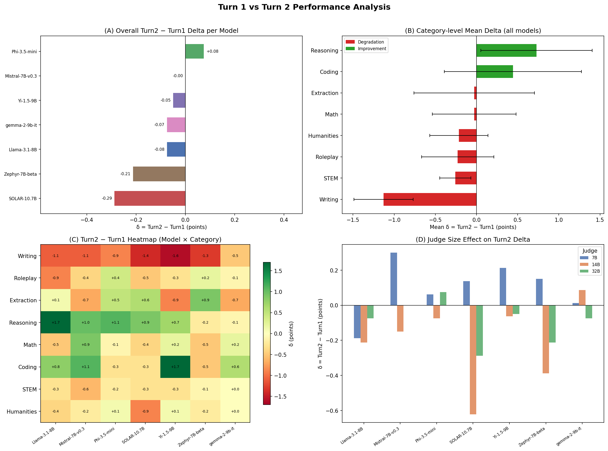
</p>

**Fig 8. Turn 1 → Turn 2 점수 변화(δ)** — Reasoning/Math에서 하락이 크고, 카테고리별로 패턴이 다르다.

---

## RQ4: 외부 Judge 검증 (InternLM / GPT-4o-mini)

<p align="center">
  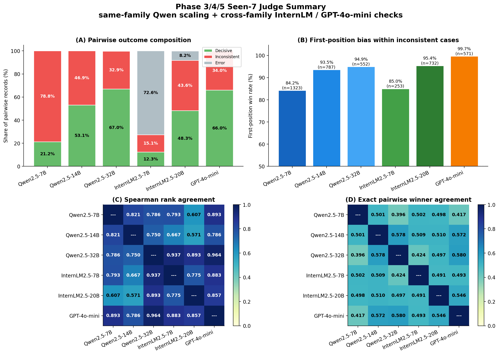
</p>

**Fig 9. Judge 6종 종합 비교** — Qwen-32B 기준 랭킹이 InternLM2.5-20B(ρ=0.893), GPT-4o-mini(ρ=0.964)에서 유지.

<p align="center">
  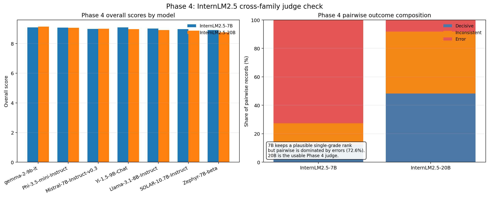
</p>

**Fig 10. InternLM judge 결과** — InternLM2.5-7B는 높은 오류율(72.62%)로 신뢰도 낮음. 20B는 Qwen-32B와 ρ=0.893.

<p align="center">
  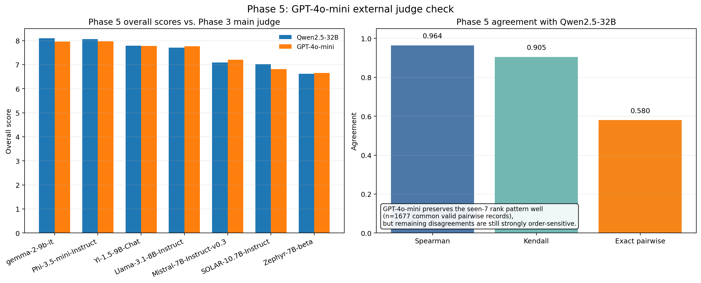
</p>

**Fig 11. GPT-4o-mini judge 결과** — 오류율 0%, 불일치율 33.99%, Qwen-32B와 ρ=0.964.

---

## 변별도 분석

<p align="center">
  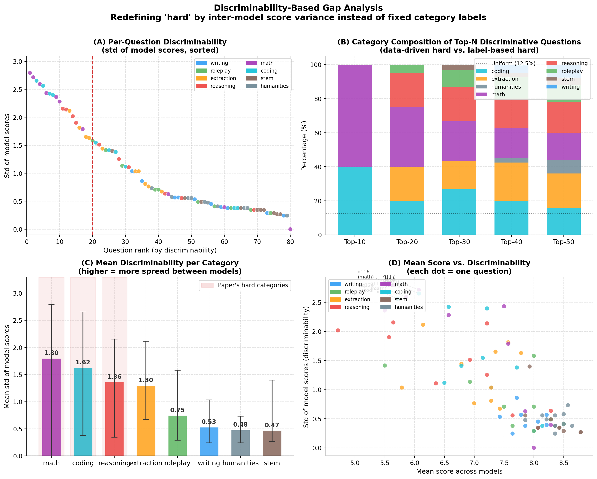
</p>

**Fig 12. 문항별 변별도(모델 간 score std)** — 카테고리별로 변별력 차이가 크다. 결과: `data/en/results/results_discriminability.csv`

---

## 실행 방법

```bash
# 환경 설정
pip install -r requirements.txt
export PYTHONPATH=src

# A100 판정 실행
bash scripts/run/a100/run_judge_phase3_a100.sh

# 분석 스크립트
python3 scripts/analysis/analyze_phase3.py
python3 scripts/analysis/analyze_phase345.py
python3 scripts/analysis/analyze_position_bias.py
python3 scripts/analysis/analyze_discriminability.py
python3 scripts/analysis/analyze_turn_degradation.py

# 로컬 Mock 테스트
bash scripts/run/local/run_mock_full.sh
```

---

## 데이터 파일 목록

| 파일 | 설명 |
|------|------|
| `results_phase3_judge_7B.csv` | Qwen-7B judge 결과 |
| `results_phase3_judge_14B.csv` | Qwen-14B judge 결과 |
| `results_phase3_judge_32B.csv` | Qwen-32B judge 결과 |
| `results_phase3_judge_*_reference.csv` | Reference-guided 결과 |
| `results_phase3_scaling.csv` | Judge 크기 스케일링 분석 |
| `results_phase3_qsize.csv` | 문항 수 민감도 분석 |
| `results_phase4_judge_internlm7b.csv` | InternLM-7B judge 결과 |
| `results_phase4_judge_internlm20b.csv` | InternLM-20B judge 결과 |
| `results_phase4_summary.csv` | InternLM judge 요약 |
| `results_phase5_gpt4omini.csv` | GPT-4o-mini judge 결과 |
| `results_phase5_summary.csv` | GPT-4o-mini judge 요약 |
| `results_phase345_judge_summary.csv` | 6개 judge 종합 비교 |
| `results_phase345_judge_agreement.csv` | Judge 간 일치도 분석 |
| `results_position_bias.csv` | Position bias 분석 |
| `results_turn_degradation.csv` | Turn 2 성능 저하 분석 |
| `results_discriminability.csv` | 문항별 변별도 |
| `results_unseen_*.csv` | 비훈련 모델(EXAONE, Falcon) 검증 |

> 번역 타당성 결과(`results_translation_validity*.csv`)는 `data/ko/results/`에 저장.
